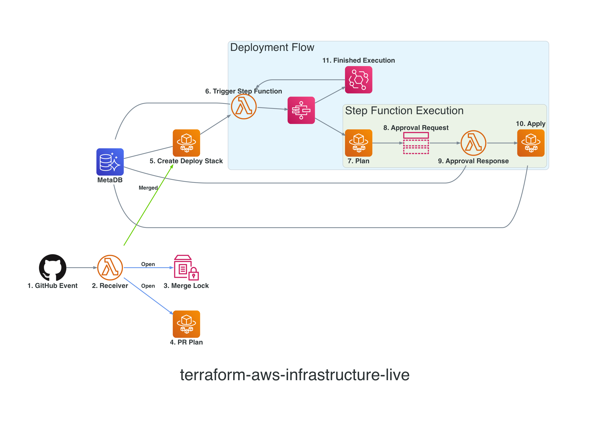

# Design

<!--ts-->
* [Design](DESIGN.md#design)
   * [Problem](DESIGN.md#problem)
   * [Solution](DESIGN.md#solution)
   * [Diagram](DESIGN.md#diagram)
   * [Commit Statuses](DESIGN.md#commit-statuses)
   * [Step Function Input](DESIGN.md#step-function-input)
   * [Rollback New Provider Resources](DESIGN.md#rollback-new-provider-resources)
   * [Infrastructure Repository Requirements](DESIGN.md#infrastructure-repository-requirements)
   * [Why use AWS Step Function for the deployment flow?](DESIGN.md#why-use-aws-step-function-for-the-deployment-flow)
      * [Step Function](DESIGN.md#step-function)
         * [Pros](DESIGN.md#pros)
      * [CodePipeline](DESIGN.md#codepipeline)
         * [Pros](DESIGN.md#pros-1)
         * [Cons](DESIGN.md#cons)
   * [Pricing](DESIGN.md#pricing)
      * [Lambda](DESIGN.md#lambda)
      * [ECS](DESIGN.md#ecs)
      * [Step Function](DESIGN.md#step-function-1)
      * [RDS](DESIGN.md#rds)
      * [EventBridge](DESIGN.md#eventbridge)
<!--te-->

## Problem
 
`terragrunt run-all` commands have a limitation of inaccurately outputting the dependency values for child terraform plans if the dependency configuration changes. The current advice is to exclude `terragrunt run-all` from CI/CD systems and run individual `terragrunt` commands within each target directory (see [GitHub issue](https://github.com/gruntwork-io/terragrunt/issues/720#issuecomment-497888756)). This imposes the tedious process of manually determining what directories to run on and the explicit ordering between them within the CI/CD pipeline. As other users of Terragrunt have [stated](https://github.com/gruntwork-io/terragrunt/issues/262
), there's a need for some way to manage the dependency changes before applying the changes that were made within the PR. This module brings an AWS native solution to this problem.
 
 
## Solution
 
Before getting into how the entire module works, we'll dive into the proposed solution to the problem and how it boils down to a specific piece of the CI/CD pipeline. As mentioned above, the `terragrunt run-all` command will produce an inaccurate dependency value for child directories that depend on parent directories that haven't been applied yet. If all parent dependencies were applied beforehand, the dependency value within the child Terraform plan would then be valid. So what if we created a component of a CI/CD pipeline that detects all dependency paths that include changes, runs a separate approval flow for each of those paths, and then runs an approval flow for the child path? This will ensure that every `terragrunt plan` command contains valid dependency values.
 
This module includes two different approaches to detecting changes which we will call "graph scan" and "plan scan". The scan type can be toggled via the `create_deploy_stack_scan_type` Terraform variable. The `graph` scan will initially use the `git diff` command to collect directories that contain .tf or .hcl file changes. Using mapping of the terragrunt directories and their associated dependency list, the script will recursively collect directories that contain dependency changes. The `plan` scan approach will run the command `terragrunt run-all plan -detailed-exitcode` (command is shortened to include only relevant arguments). The `terragrunt run-all plan` portion will traverse from the root terragrunt directory down to every child Terragrunt directory. It will then run `terraform plan -detailed-exitcode` within each directory and output the [exitcode](https://www.terraform.io/cli/commands/plan#detailed-exitcode) that represents whether the plan contains changes or not. If the directory does contain changes, the directory and its associated dependencies that also have changed will be collected. This excludes dependencies that are unchanged but upstream from changed directories. For example, consider the following directory dependency tree:

```
dev/vpc
    \
    dev/rds
        \
        dev/ec2
```
if `dev/rds` and `dev/ec2` have changes, only `dev/rds` and `dev/ec2` will be collected.

After all directories and their associated dependencies are gathered, they are put into separate database records that a downstream Lambda Function will then use. The Lambda Function will determine the order in which the directories are passed into the Step Function deployment flow. This entire process includes no human intervention and removes the need for users to define the deployment ordering all together. The actual code that runs this process is defined [here](./docker/src/create_deploy_stack/create_deploy_stack.py).
 

## Diagram
 

 
1. An GitHub webhook will be created for the target GitHub repository. The webhook will send requests to the AWS Lambda Function endpoint for open PR activities or merge PR events.

2.  
  - The Lambda Function will validate the request's SHA-256 header value with the secret configured within Terraform module. If the request is authenticated, the function will check if the payload meets specific requirements. The payload must contain attributes that reflect that the GitHub event was an open PR activity or PR merge, includes .tf and/or .hcl file additions and/or modifications, and has a PR base ref that is the trunk branch (trunk branch represents the live Terraform configurations and should be reflected within the Terraform state files).
  
  - The Lambda Function then acts as a branch that runs different logic depending on the GitHub event. If the Github event was open PR activity, the Lambda Function will collect a list of unique directories that contain new/modified .hcl and/or .tf files. For every directory, the Lambda Function will run an ECS task (#4). In addition to the ECS task(s), the Lambda Function will check if there's a deployment flow in progress and add the check to the PR's commit status. If the Github event was a merged PR, an ECS task named Create Deploy Stack will be run.

3. The Lambda Function will load an AWS System Manager Parameter Store value reference as `merge_lock` that will contain the PR ID of the deployment in progress or `none` if there isn't any in progress. Merging will be locked until the deployment flow is done. Once the deployment flow is finished, the downstream Lambda Function will reset the parameter value (see #6).

    `**NOTE: The PR committer will have to create another commit once the merge lock status is unlocked to get an updated merge lock commit status. **`

4. The ECS task will run a plan on the Terragrunt directory. This will output the Terraform plan to the CloudWatch logs for users to see what resources are proposed to be created, modified, and/or deleted.

5. The task will overwrite the current merge lock value with the associated PR ID. Next, the task will scan the trunk branch for changes made from the PR. The task will insert records into the metadb for each directory that contains differences in its respective Terraform plan. After the records are inserted, the task will invoke the #6 Lambda Function.
 
6. A Lambda Function referenced within the module as `trigger_sf` will select metadb records for Terragrunt directories with account and directory level dependencies met. The Lambda will convert the records into JSON objects and pass each JSON as input into separate Step Function executions. 
 
7. An ECS task referenced as `terra_run` within the module will run the record's associated `plan_command`. This will output the Terraform plan to the CloudWatch logs for users to see what resources will be created, modified, and/or deleted.
 
8. The Step Function machine will publish a message to the approval request SNS topic containing the execution context information. The SNS topic will send the message to the following approval request outlets:
  - Lambda Function referenced as `approval_request` within the module will send an email via AWS SES to every email address defined under the record's `voters` attribute. The contents of the email will include metadata about the execution, a link to the Terraform plan, and a very minimal HTML forum for voters to cast their vote.

9. When a voter approves or rejects a deployment, the Lambda Function referenced as `approval_response` will update the records approval or rejection count. Once the minimum approval count is met, the Lambda Function will send a success [task token](https://docs.aws.amazon.com/step-functions/latest/dg/connect-to-resource.html#connect-wait-token) back to the associated Step Function execution.

10. Based on which minimum approval count is met, the `Approval Results` Step Function task will conditionally choose which downstream task to run next. If the rejection count is met, the `Reject` task will run and the Step Function execution will be finished. If the approval count is met, the `terra_run` ECS task will run the record's associated `apply_command`. This Terraform apply output will be displayed within the CloudWatch logs for users to see what resources were created, modified, and/or deleted. If the deployment created new provider resources, the task will update the record's associated `new_resources` attribute with the new provider resource addresses that were created. This [Rollback New Provider Resources](#rollback-new-provider-resources) section below will explain how the `new_resources` attribute will be used. 
 
11. After every Step Function execution, a Cloudwatch event rule will invoke the `trigger_sf` Lambda Function mentioned in step #6. The Lambda Function will update the Step Function execution's associated metadb record status with the Step Function execution status. If the `Success` task of the Step Function was successful, the updated status will be `succeeded` and if the `Reject` task was successful, the updated status will be `failed`.

    The Lambda Function will then repeat the same process as mentioned in step #6 until there are no records that are waiting to be run with a Step Function execution. As stated above, the Lambda Function will update the merge lock status value to allow other Terraform-related PRs to be merged.

## Commit Statuses

Each ECS task with the addition of the merge lock will be available to send commit statuses displaying the current state of the task. The commit statuses can be toggled via the `var.commit_status_config` variable or by manually editing the actual configuration stored on AWS System Manager Parameter Store.

Each of the ECS-related commit statuses will link to the task's associated AWS CloudWatch Log Stream. If the calling service failed to run the task, the service's page or log link will be used.

`** NOTE: Permissions for users (including approval voters) to access the log streams are not managed via this module **`
## Step Function Input
 
Each execution is passed a JSON input that contains record attributes that will help configure the Step Function tasks. A sample JSON input will look like the following:
 
```
{
 "execution_id": "run-1-c8c5-dev-baz-729",
 "is_rollback": false,
 "pr_id": 1,
 "commit_id": "c8c5f6afc7345bd21cd79acaf740dc18b60755e3",
 "base_ref": "refs/heads/master",
 "head_ref": "refs/heads/feature-5320d796-6511-4b05-8adf-47382b46afe2",
 "cfg_path": "directory_dependency/dev-account/us-west-2/env-one/baz",
 "cfg_deps": [
   "directory_dependency/dev-account/global"
 ],
 "status": "running",
 "plan_command": "terragrunt plan --terragrunt-working-dir directory_dependency/dev-account/us-west-2/env-one/baz",
 "apply_command": "terragrunt apply --terragrunt-working-dir directory_dependency/dev-account/us-west-2/env-one/baz -auto-approve",
 "new_providers": ["registry.terraform.io/hashicorp/null"],
 "new_resources": ["null_resource.this"],
 "account_name": "dev",
 "account_path": "directory_dependency/dev-account",
 "account_deps": [
   "shared_services"
 ],
 "voters": [
   "success@simulator.amazonses.com"
 ],
 "approval_voters": [],
 "min_approval_count": 1,
 "rejection_voters": [],
 "min_rejection_count": 1,
 "plan_role_arn": "arn:aws:iam::111111111111:role/terraform-aws-infrastructure-live-ci-plan",
 "apply_role_arn": "arn:aws:iam::111111111111:role/terraform-aws-infrastructure-live-ci-apply"
}
```
 
`execution_id`: An unique identifier that represents the execution name. The ID is formatted to be `run-{pr_id}-{first four digits of commit_id}-{account_name}-{leaf directory of cfg_path}-{random three digits}`. Only three random digits are used because if the record has a long account_name and/or cfg_path, the execution_id may exceed Step Function's 80 characters or less execution name limit.
 
`is_rollback`: Determines if the execution pertains to a deployment that will roll back changes from a previous execution. (See the [Rollback New Provider Resources](#rollback-new-provider-resources) section for more info)
 
`pr_id`: Pull Request Number
 
`commit_id`: Pull Request merge commit ID
 
`base_ref`: Branch that the pull request was merged into
 
`head_ref`: Branch that was merged into the base branch
 
`cfg_path`: A directories relative path to the GitHub repository's root path
 
`cfg_deps`: List of `cfg_path` directories that this `cfg_path` depends on. Dependencies are defined via Terragrunt dependencies blocks (see this [Terragrunt page](https://terragrunt.gruntwork.io/docs/reference/config-blocks-and-attributes/#dependencies) for more info)
 
`status`: Status of the Step Function execution. Statuses can be `waiting|running|succeeded|failed|aborted`
 
`plan_command`: Terragrunt command used to display the Terraform plan within the Step Function `Plan` task
 
`apply_command`: Terragrunt command used to apply the Terraform configurations within the Step Function `Apply` task
 
`new_providers`: List of new providers introduced by the pull request (See the [Rollback New Provider Resources](#rollback-new-provider-resources) section for more info)
 
`new_resources`: List of new provider resources that were deployed  (See the [Rollback New Provider Resources](#rollback-new-provider-resources) section for more info)
 
`account_name`: AWS account the `cfg_path` will deploy resources to
 
`account_deps`: List of AWS accounts (`account_name`) the record's `account_name` depends on
 
`voters`: List of email addresses to send an approval request to
 
`approval_voters`: List of `voters` who have approved the deployment
 
`min_approval_count`: Minimum number of approvals needed to deploy
 
`rejection_voters`: List of `voters` who have rejected the deployment
 
`min_rejection_count`: Minimum number of rejections needed to decline the deployment
 
`plan_role_arn`: AWS IAM role ARN used to run `plan_command`
 
`apply_role_arn`: AWS IAM role ARN used to run `apply_command`
 
## Rollback New Provider Resources
 
Let us say a PR introduces a new provider and resource block. The PR is merged and the deployment associated with the new provider resource succeeds. For some reason, a downstream deployment fails and the entire PR needs to be reverted. The revert PR is created and merged. The directory containing the new provider resource will be non-existent within the revert PR although the terraform state file associated with the directory will still contain the new provider resources. Given that the provider block and its associated provider credentials are gone, Terraform will output an error when trying to initialize the directory within the deployment flow. This type of scenario is also referenced in this [StackOverflow post](https://stackoverflow.com/a/57829202/12659025).
 
To handle this scenario, the CI/CD pipeline will document which directories define new provider resources within the metadb. After every deployment, any new provider resources that were deployed will also be documented. If any deployment flow fails, the CI/CD pipeline will start Step Function executions for every directory that contains new providers with `-target` flags to destroy the new provider resources. To see it in action, run the [test_rollback_providers.py](./tests/e2e/test_rollback_providers.py) test.

## Infrastructure Repository Requirements
 
- Terraform files can be present but they must be referenced by Terragrunt configurations for them to be detected by the CI/CD workflow
- Configuration can't depend on environment variables that are not already passed to the tasks
 
## Why use AWS Step Function for the deployment flow?
 
It would seem like CodePipeline would be the go-to AWS service for hosting the deployment workflow. After a long period of trying both, I found the following trade-offs.
 
### Step Function
 
#### Pros
 
- Ability to handle complex conditional workflows by using [choice states](https://docs.aws.amazon.com/step-functions/latest/dg/amazon-states-language-choice-state.html)
- Ability to capture errors and define fallback states (see [here](https://docs.aws.amazon.com/step-functions/latest/dg/concepts-error-handling.html) for more info)
- Updates to the workflow in itself will not fail the current execution and changes will be reflected within future executions [(reference)](https://docs.aws.amazon.com/step-functions/latest/dg/getting-started.html#update-state-machine-step-3
)
- Ability to customize the execution name which is useful in searching for executions within the console
 
### CodePipeline
 
#### Pros
 
- Integrated approval flow managed via IAM users/roles
- Simple and intuitive GUI
- Satisfied with just being able to do account-level execution concurrency
- A single AWS account with a simple plan, approval, and deploy workflow is only needed
 
#### Cons
 
- Can't handle complex task branching. The current implementation is fairly simple but newer versions of this module may contain feature Step Function definitions that handle complex deployment workflows.
- Concurrent runs are not available which can lead to slow deployment rollouts for changes within deeply rooted dependencies or changes within a large number of independent sibling directories
- Updates to the pipeline in itself causes the execution to fail and prevent any downstream actions from running as described [here](https://docs.aws.amazon.com/codepipeline/latest/userguide/pipelines-edit.html
)
- Free tier only allows for one free pipeline a month. After the free tier, the cost for each active pipeline is $1 a month not including the additional charges for storing the CodePipeline artifacts within S3. Given that this module is intended for handling a large amount of AWS accounts, a CodePipeline for each account would be necessary which would spike up the total cost of running this module.
 
## Pricing
 
### Lambda
 
The AWS Lambda free tier includes one million free requests per month and 400,000 GB seconds of computing time per month. Given the use of the Lambda Functions are revolved around infrastructure changes, the total amount of invocations will likely be minimal and will probably chip away only a tiny fraction of the free tier allocation.
 
### ECS

AWS ECS Fargate does not have a free tier. The cost of running the tasks will depend on the resource configurations and duration of the tasks. Each of the tasks' CPU, memory, and storage capacity can be declared within the module and should be tuned to your needs. It's important to consider having a larger memory capacity for the create deploy stack task given the task is running queries on the metadb that loads the query results into memory. The terra run apply tasks do run an insert query but don't require larger resources. See Terraform's recommendations [here](https://www.terraform.io/enterprise/system-overview/capacity).
 
### Step Function

The cost for the Step Function machine is based on state transitions. Luckily 4,000 state transitions per month are covered under the free tier. The Step Function definition contains only a minimal amount of state transitions. Unless the infrastructure repo contains frequent and deeply rooted dependency changes, the free tier limit will likely never be exceeded.
 
### RDS
 
The metadb uses a [Aurora Serverless](https://aws.amazon.com/rds/aurora/serverless/) PostgreSQL database type. Essentially a serverless database will allow users to only pay when the database is in use and free up users from managing the database capacity given that it will automatically scale based on demand. The serverless type is beneficial for this use case given that the metadb is only used within CI/CD services after a PR merge event. Since this module is dealing with live infrastructure and not application changes, there will likely be long periods between PR merges. The serverless database starts with one ACU (Aurora Capacity Units) which contains two GB of memory. The use of the database is likely never to scale beyond using two GB of memory so using one ACU will likely be constant.
 
### EventBridge
 
Given that EventBridge rules and event deliveries are free, the Step Function execution rule and event delivery to the Lambda Function produces at no cost.

