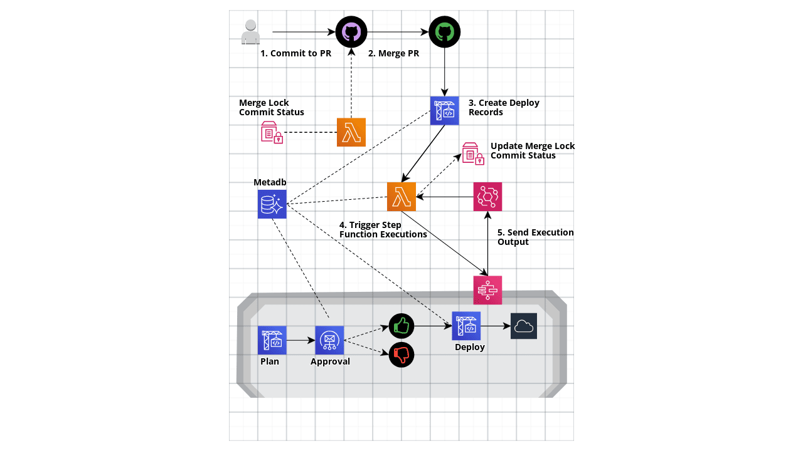

# Terraform AWS Infrastructure Live CI
 
## Problem
 
`terragrunt run-all` commands have a limitation of inaccurately outputting the dependency values for child terraform plans if the dependency configuration changes. The current advice is to exclude `terragrunt run-all` from CI systems and run individual `terragrunt` commands within each target directory (see [GitHub issue](https://github.com/gruntwork-io/terragrunt/issues/720#issuecomment-497888756)). This imposes the tedious process of manually determining what directories to run on and the explicit ordering between them within the CI pipeline. As other users of Terragrunt have [stated](https://github.com/gruntwork-io/terragrunt/issues/262
), there's a need for some way to manage the dependency changes before applying the changes that were made within the PR. This module brings an AWS native solution to this problem.
 
 
## Solution
 
Before getting into how the entire module works, we'll dive into the proposed solution to the problem and how it boils down to a specific piece of the CI pipeline. As mentioned above, the `terragrunt run-all` command will produce an inaccurate dependency value for child directories that depend on parent directories that haven't been applied yet. Obviously if all parent dependencies were applied beforehand, the dependency value within the child Terraform plan would then be valid. So what if we created a component of a CI pipeline that detects all dependency paths that include changes, run a separate approval flow for each of those paths, and then run an approval flow for the child configuration? This will ensure that every `terragrunt plan` command contains valid dependency values.
 
This module includes two different approaches to detecting changes which we will call "graph scan" and "plan scan". The scan type can be toggled via the `create_deploy_stack_graph_scan` Terraform variable. The graph scan will initially use the `git diff` command to collect directories that contain .tf or .hcl file changes. Using a mapping of the terragrunt directories and their associated dependency list, the script will recursively collect directories that contain dependency changes. The plan scan approach will run the command `terragrunt run-all plan -detailed-exitcode` (command is shortened to include only relevant arguments). The `terragrunt run-all plan` portion will traverse from the root terragrunt directory down to every child Terragrunt directory. It will then run `teraform plan -detailed-exitcode` within each directory and output the [exitcode](https://www.terraform.io/cli/commands/plan#detailed-exitcode) that represents whether the plan contains changes or not. If the directory does contain changes, the directory and its associated directory dependencies that also have changes will be collected. For example, if `dev/bar` has changed and has a dependency on unchanged `dev/foo` and changed `dev/baz`, `dev/bar` and `dev/baz` but not `dev/foo` will be collected. 

After all directories and their associated dependencies are gathered, they are put into separate database records that will then be used by an downstream Lambda Function. The Lambda Function will determine the order in which the directories are they are passed into the Step Function deployment flow. This entire process includes no human intervention and removes the need for users to define the deployment ordering all together. The actual code that runs this process is defined [here](./buildspecs/create_deploy_stack/create_deploy_stack.py).
 
 
## Design
 

 
1. A GitHub user commits to a feature branch and creates a PR to merge into the source branch. The source branch represents the live Terraform configurations and should be reflected within the Terraform state files. As the user continues to push Terraform related commit changes to the PR, a Lambda function will update the commit status notifying if merging the PR is available or not. Merging will be locked if a merged PR is in the process of the CI pipeline. Once the CI pipeline is finished, the downstream Lambda function (see #4) will update the merge lock status value.
 
   `**NOTE The PR committer will have to create another commit once the merge lock status is unlocked to get an updated merge lock commit status. **`
 
2. If the merge lock commit status is unlocked, a user with merge permissions can then merge the PR.
 
3. Once the PR is merged, a Codebuild project will update the merge lock status and then scan the source branch for changes made from the PR. The build will insert records into the metadb for each directory that contains differences in its respective Terraform plan. After the records are inserted, the build will invoke another Lambda function.
 
4. A Lambda function will select metadb records for Terragrunt directories with account and directory level dependencies met. The Lambda will convert the records into json objects and pass each json into separate Step Function executions. An in-depth description of the Step Function flow can be found under the `Step Execution Flow` section.
 
5. After every Step Function execution, a Cloudwatch event rule will invoke the Lambda Function mentioned in step #4 above. The Lambda function will update the Step Function execution's associated metadb record status with the Step Function execution status. The Lambda function will then repeat the same process as mentioned in step #4 until there are no records that are waiting to be runned with a Step Function execution. As stated above, the Lambda function will update the merge lock status value to allow other Terraform related PRs to be merged.
 
## Step Function Execution Flow
 
### Input
 
Each execution is passed a json input that contains record attributes that will help configure the tasks within the Step Function. A sample json input will contain the following:
 
```
{
 "execution_id": "run-1-c8c5-dev-baz-729",
 "is_rollback": false,
 "pr_id": 1,
 "commit_id": "c8c5f6afc7345bd21cd79acaf740dc18b60755e3",
 "base_ref": "refs/heads/master",
 "head_ref": "refs/heads/feature-5320d796-6511-4b05-8adf-47382b46afe2",
 "cfg_path": "directory_dependency/dev-account/us-west-2/env-one/baz",
 "cfg_deps": [
   "directory_dependency/dev-account/global"
 ],
 "status": "running",
 "plan_command": "terragrunt plan --terragrunt-working-dir directory_dependency/dev-account/us-west-2/env-one/baz",
 "deploy_command": "terragrunt apply --terragrunt-working-dir directory_dependency/dev-account/us-west-2/env-one/baz -auto-approve",
 "new_providers": ["registry.terraform.io/hashicorp/null"],
 "new_resources": ["null_resource.this"],
 "account_name": "dev",
 "account_path": "directory_dependency/dev-account",
 "account_deps": [
   "shared_services"
 ],
 "voters": [
   "success@simulator.amazonses.com"
 ],
 "approval_voters": [],
 "min_approval_count": 1,
 "rejection_voters": [],
 "min_rejection_count": 1,
 "plan_role_arn": "arn:aws:iam::111111111111:role/terraform-aws-infrastructure-live-ci-plan",
 "deploy_role_arn": "arn:aws:iam::111111111111:role/terraform-aws-infrastructure-live-ci-deploy"
}
```
 
`execution_id`: An unique identifier that represents the execution name. The ID is formatted to be `run-{pr_id}-{first four digits of commit_id}-{account_name}-{leaf child directory of cfg_path}-{random three digits}`. Only three random digits are used because if the record has a long account_name and/or cfg_path, the execution_id may exceed Step Function's 80 character or less execution name limit.
 
`is_rollback`: Determines if the execution pertains to a deployment that will rollback changes from a previous execution. (See section `Rollbacks` for more info)
 
`pr_id`: Pull Request Number
 
`commit_id`: Pull Request merge commit ID
 
`base_ref`: Branch that the pull request was merged into
 
`head_ref`: Branch that was merged into the base branch
 
`cfg_path`: A directories relative path to the GitHub repository's root path
 
`cfg_deps`: List of `cfg_path` directories that this `cfg_path` depends on. Dependencies are defined via Terragrunt dependencies blocks (see this [Terragrunt page](https://terragrunt.gruntwork.io/docs/reference/config-blocks-and-attributes/#dependencies) for more info)
 
`status`: Status of the Step Function execution. Statuses can be `waiting|running|succeeded|failed|aborted`
 
`plan_command`: Terragrunt command used to display the Terraform plan within the Step Function `Plan` task
 
`deploy_command`: Terragrunt command used to deploy the Terraform configurations within the Step Function `Deploy` task
 
`new_providers`: List of new providers introduced by the pull request (See section `Rollbacks` for more info)
 
`new_resources`: List of new provider resources that were deployed (See section `Rollbacks` for more info)
 
`account_name`: AWS account the `cfg_path` will deploy resources to
 
`account_deps`: List of AWS accounts (`account_name`) the record's `account_name` depends on
 
`voters`: List of email addresses to send approval request to
 
`approval_voters`: List of `voters` who have approved the deployment
 
`min_approval_count`: Minimum number of approvals needed to deploy
 
`rejection_voters`: List of `voters` who have rejected the deployment
 
`min_rejection_count`: Minimum number of rejections needed to decline the deployment
 
`plan_role_arn`: AWS IAM role used to run `plan_command`
 
`deploy_role_arn`: AWS IAM role used to run `deploy_command`
 
 
### Definition
 
The Step Function definition comprises of six tasks.
 
`Plan`: A CodeBuild project will spin up a build that will run the record's associated `plan_command`. This will output the Terraform plan to the CloudWatch logs for users to see what resources will be created/modified.
 
`Request Approval`: A Lambda Function will send an approval request via AWS SES to every email address defined under the record's `voters` attribute. When a voter approves/rejects a deployment, a separate Lambda Function updates the records approval or rejection count. Once the minimum approval count is met, the Lambda Function will send a task success token back to the associated Step Function execution.
 
`Approval Results`: Based on which minimum approval count is met, this task will conditionally choose which task to run next. If the approval count is met, the `Deploy` task will be runned. If the rejection count is met, the `Reject` task will be runned.
 
`Deploy`: A CodeBuild project will spin up a build that will run the record's associated `deploy_command`. This Terraform apply output will be displayed within the CloudWatch logs for users to see what resources were created/modified. If the deployment created new provider resources, a bash script will update the record's associated `new_resources` attribute with the new provider resource addresses that were created.
 
`Success`: If all Step Function tasks were successful, this task will output a status of `succeeded` along other output attributes.
 
`Reject`: If any Step Function task was unsuccessful, this task will output a status of `failed` along other output attributes.
 
### Rollback New Provider Resources
 
Lets say a PR introduces a new provider and resource block. The PR is merged and the deployment associated with the new provider resource succeeds. For some reason a downstream deployment fails and the entire PR needs to be reverted. The revert PR is created and is merged. The directory containing the new provider resource will be non-existent within the revert PR although the terraform state file associated with the directory will still contain the new provider resources.Given that the provider block and it's associated provider credentials are gone, Terraform will output an error when trying to initialize the directory within the deployment flow. This type of scenario is also referenced in this [StackOverflow post](https://stackoverflow.com/a/57829202/12659025).
 
To handle this scenario, the CI pipeline will document which directories define new provider resources within the metadb. After every deployment, any new provider resources that were deployed will also be documented. If any deployment flow fails, the CI pipeline will start Step Function executions for every directory that contains new providers and target destroy the new provider resources. To see it in action, run the [test_rollback_providers.py](./tests/integration/test_rollback_providers.py) test.
 
## Infrastructure Repository Requirements
 
- Terraform files can be present but they must be referenced by Terragrunt configurations in order for it be detected by the CI workflow
- Configuration can't depend on environment variables that are not already passed to the builds
 
## Why AWS Step Function for deployment flow?
 
It would seem like CodePipeline would be the go to AWS service for hosting the deployment workflow. After a long period of trying both I found the following trade offs.
 
### Step Function
 
#### Pros
 
- Ability to handle complex conditional workflows by using [choice states](https://docs.aws.amazon.com/step-functions/latest/dg/amazon-states-language-choice-state.html)
- Ability to capture errors and define fallback states (see [here](https://docs.aws.amazon.com/step-functions/latest/dg/concepts-error-handling.html) for more info)
- Updates to the workflow in itself will not fail the current execution and changes will be reflected within future executions [(reference)](https://docs.aws.amazon.com/step-functions/latest/dg/getting-started.html#update-state-machine-step-3
)
- Ability to customize the execution name which is useful searching for executions within the console
 
### CodePipeline
 
#### Pros
 
- Integrated approval flow managed via IAM users/roles
- Simple and intuitive GUI
- Satisfied with just being able to do account-level execution concurrency
- A single AWS account with a simple plan, approval, deploy workflow is only needed
 
#### Cons
 
- Can't handle complex task branching. The current implementation is fairly simple but newer versions of this module may contain feature Step Function definitions that handle complex deployment workflows.
- Concurrent runs are not available which can lead slow deployment rollouts for changes within deeply rooted dependencies or changes within a large amount of independent sibling directories
- Updates to the pipeline in itself causes the execution to fail and prevent any downstream actions from running as described [here](https://docs.aws.amazon.com/codepipeline/latest/userguide/pipelines-edit.html
)
- Free tier only allows for one free pipeline a month. After the free tier, the cost for each active pipeline is $1 a month not including the additional charges for storing the CodePipeline artifacts within S3. Given that this module is intended for handling a large amount of AWS accounts, a CodePipeline for each account would be necessary which would spike up the total cost for running this module.
 
## Pricing
 
### Lambda
 
All six Lambda Functions use the x86 architecture. The price is $0.0000166667 for every GB-second and $0.20 per million requests. The AWS Lambda free tier includes one million free requests per month and 400,000 GB-seconds of compute time per month. Given use of the Lambda Functions are revolved around infrastructure changes, the total amount of invocations will likely be minimal and will probably only chip away a tiny fraction of the free tier allocation.
 
### CodeBuild
 
The build.general1.small instance type is used for both builds within this module. The cost for the instance is $0.00425 per build minute. The price per build will vary since the amount of resources within Terraform configurations will also vary. The more Terraform resources the configuration manages, the longer the build will be.
 
### Step Function
 
For the `us-west-2a` region, the cost for the [standard workflow](https://docs.aws.amazon.com/en_us/step-functions/latest/dg/concepts-standard-vs-express.html) is $0.0279 per 1,000 state transitions. Luckily 4,000 state transitions per month are covered under the free tier. The Step Function definition contains only four state transitions and unless the repo contains frequent deeply rooted dependency changes, the free tier limit will likely never be exceeded.
 
### RDS
 
The metadb uses a [Aurora Serverless](https://aws.amazon.com/rds/aurora/serverless/) PostgreSQL database type. Essentially a serverless database will allow users to only pay for when the database is in use and free up users from managing the database capacity given that it will automatically scale based on demand. The serverless type is beneficial for this use case given that the metadb is only used when a PR is merged. Since this module is dealing with live infrastructure and not application changes, there will likely be long periods of time between PR merges. The serverless type starts with one ACU (Aurora Capacity Units) which contains two GB of memory. The use of the database is likely never to scale beyond using two GB of memory so using one ACU will likely be constant. The pricing is $0.08 per ACU Hour for the `us-west-2a` region.
 
### EventBridge
 
Given EventBridge rules and event deliveries are free, the Step Function execution rule and event delivery to the Lambda Function produces no cost.
 
## CLI Requirements
 
Requirements below are needed in order to run `terraform apply` within this module. This module contains null resources that run bash scripts to create docker images, zip directories, install pip packages, and query the RDS database.
 
| Name | Version |
|------|---------|
| awscli | >= 1.22.5 |
| python3 | >= 3.9 |
| pip | >= 22.0.4 |
| docker | >= 20.10.8 |
 
<!-- BEGINNING OF PRE-COMMIT-TERRAFORM DOCS HOOK -->
## Requirements

| Name | Version |
|------|---------|
| terraform | >= 0.14.0 |
| aws | >= 3.44 |
| github | ~> 4.0 |

## Providers

| Name | Version |
|------|---------|
| archive | n/a |
| aws | >= 3.44 |
| github | ~> 4.0 |
| null | n/a |

## Inputs

| Name | Description | Type | Default | Required |
|------|-------------|------|---------|:--------:|
| account\_parent\_cfg | AWS account-level configurations.<br>  - name: AWS account name (e.g. dev, staging, prod, etc.)<br>  - path: Parent account directory path relative to the repository's root directory path (e.g. infrastructure-live/dev-account)<br>  - voters: List of email addresses that will be sent approval request to<br>  - min\_approval\_count: Minimum approval count needed for CI pipeline to run deployment<br>  - min\_rejection\_count: Minimum rejection count needed for CI pipeline to decline deployment<br>  - dependencies: List of AWS account names that this account depends on before running any of it's deployments <br>    - For example, if the `dev` account depends on the `shared-services` account and both accounts contain infrastructure changes within a PR (rare scenario but possible),<br>      all deployments that resolve infrastructure changes within `shared-services` need to be applied before any `dev` deployments are executed. This is useful given a<br>      scenario where resources within the `dev` account are explicitly dependent on resources within the `shared-serives` account.<br>  - plan\_role\_arn: IAM role ARN within the account that the plan build will assume<br>    - \*\*CAUTION: Do not give the plan role broad administrative permissions as that could lead to detrimental results if the build was compromised\*\*<br>  - deploy\_role\_arn: IAM role ARN within the account that the deploy build will assume<br>    - Fine-grained permissions for each Terragrunt directory within the account can be used by defining a before\_hook block that<br>      conditionally defines that assume\_role block within the directory dependant on the Terragrunt command. For example within `prod/iam/terragrunt.hcl`,<br>      define a before hook block that passes a strict read-only role ARN for `terragrunt plan` commands and a strict write role ARN for `terragrunt apply`. Then<br>      within the `deploy_role_arn` attribute here, define a IAM role that can assume both of these roles. | <pre>list(object({<br>    name                = string<br>    path                = string<br>    voters              = list(string)<br>    min_approval_count  = number<br>    min_rejection_count = number<br>    dependencies        = list(string)<br>    plan_role_arn       = string<br>    deploy_role_arn     = string<br>  }))</pre> | n/a | yes |
| api\_name | Name of AWS Rest API | `string` | `null` | no |
| api\_stage\_name | API deployment stage name | `string` | `"prod"` | no |
| approval\_request\_sender\_email | Email address to use for sending approval requests | `string` | n/a | yes |
| base\_branch | Base branch for repository that all PRs will compare to | `string` | `"master"` | no |
| build\_img | Docker, ECR or AWS CodeBuild managed image to use for the CodeBuild projects. If not specified, Terraform module will create an ECR image for them. | `string` | `null` | no |
| build\_tags | Tags to attach to AWS CodeBuild project | `map(string)` | `{}` | no |
| cloudwatch\_event\_rule\_name | Name of the CloudWatch event rule that detects when the Step Function completes an execution | `string` | `null` | no |
| codebuild\_common\_env\_vars | Common env vars defined within all Codebuild projects. Useful for setting Terragrunt specific env vars required to run Terragrunt commands. | <pre>list(object({<br>    name  = string<br>    value = string<br>    type  = optional(string)<br>  }))</pre> | `[]` | no |
| codebuild\_source\_auth\_token | GitHub personal access token used to authorize CodeBuild projects to clone GitHub repos within the Terraform AWS provider's AWS account and region. <br>  If not specified, existing CodeBuild OAUTH or GitHub personal access token authorization is required beforehand. | `string` | `null` | no |
| common\_tags | Tags to add to all resources | `map(string)` | `{}` | no |
| create\_deploy\_stack\_build\_name | Name of AWS CodeBuild project that will create the PR deployment stack into the metadb | `string` | `null` | no |
| create\_deploy\_stack\_graph\_scan | If true, the create\_deploy\_stack build will use the git detected differences to determine what directories to run Step Function executions for.<br>If false, the build will use terragrunt run-all plan detected differences to determine the executions.<br>Set to false if changes to the terraform resources are also being controlled outside of the repository (e.g AWS console, separate CI pipeline, etc.)<br>which results in need to refresh the terraform remote state to accurately detect changes.<br>Otherwise set to true, given that collecting changes via git will be significantly faster than collecting changes via terragrunt run-all plan. | `bool` | `true` | no |
| create\_deploy\_stack\_vpc\_config | AWS VPC configurations associated with terra\_run CodeBuild project. <br>Ensure that the configuration allows for outgoing traffic for downloading associated repository sources from the internet. | <pre>object({<br>    vpc_id             = string<br>    subnets            = list(string)<br>    security_group_ids = list(string)<br>  })</pre> | `null` | no |
| create\_github\_token\_ssm\_param | Determines if an AWS System Manager Parameter Store value should be created for the Github token | `bool` | `true` | no |
| enfore\_admin\_branch\_protection | Determines if the branch protection rule is enforced for the GitHub repository's admins. <br>  This essentially gives admins permission to force push to the trunk branch and can allow their infrastructure-related commits to bypass the CI pipeline. | `bool` | `false` | no |
| file\_path\_pattern | Regex pattern to match webhook modified/new files to. Defaults to any file with `.hcl` or `.tf` extension. | `string` | `".+\\.(hcl|tf)$"` | no |
| github\_token\_ssm\_description | Github token SSM parameter description | `string` | `"Github token used by github_webhook_validator Lambda Function and merge_lock Lambda function"` | no |
| github\_token\_ssm\_key | AWS SSM Parameter Store key for sensitive Github personal token | `string` | `"github-webhook-validator-token"` | no |
| github\_token\_ssm\_tags | Tags for Github token SSM parameter | `map(string)` | `{}` | no |
| github\_token\_ssm\_value | Registered Github webhook token associated with the Github provider. If not provided, module looks for pre-existing SSM parameter via `var.github_token_ssm_key` | `string` | `""` | no |
| lambda\_approval\_request\_vpc\_config | VPC configuration for Lambda approval request function | <pre>object({<br>    subnet_ids         = list(string)<br>    security_group_ids = list(string)<br>  })</pre> | `null` | no |
| lambda\_approval\_response\_vpc\_config | VPC configuration for Lambda approval response function | <pre>object({<br>    subnet_ids         = list(string)<br>    security_group_ids = list(string)<br>  })</pre> | `null` | no |
| lambda\_trigger\_sf\_vpc\_config | VPC configuration for Lambda trigger\_sf function | <pre>object({<br>    subnet_ids         = list(string)<br>    security_group_ids = list(string)<br>  })</pre> | `null` | no |
| merge\_lock\_build\_name | Codebuild project name used for determine if infrastructure related PR can be merged into base branch | `string` | `null` | no |
| merge\_lock\_ssm\_key | SSM Parameter Store key used for locking infrastructure related PR merges | `string` | `null` | no |
| merge\_lock\_status\_check\_name | Name of the merge lock GitHub status | `string` | `"Merge Lock"` | no |
| metadb\_availability\_zones | AWS availability zones that the metadb RDS cluster will be hosted in. Recommended to define atleast 3 zones. | `list(string)` | `null` | no |
| metadb\_ci\_password | Password for the metadb user used for the Codebuild projects | `string` | n/a | yes |
| metadb\_ci\_username | Name of the metadb user used for the Codebuild projects | `string` | `"ci_user"` | no |
| metadb\_name | Name of the AWS RDS db | `string` | `null` | no |
| metadb\_password | Master password for the metadb | `string` | n/a | yes |
| metadb\_port | Port for AWS RDS Postgres db | `number` | `5432` | no |
| metadb\_schema | Schema for AWS RDS Postgres db | `string` | `"prod"` | no |
| metadb\_security\_group\_ids | AWS VPC security group to associate the metadb with | `list(string)` | `[]` | no |
| metadb\_subnets\_group\_name | AWS VPC subnet group name to associate the metadb with | `string` | `null` | no |
| metadb\_username | Master username of the metadb | `string` | `"root"` | no |
| pr\_approval\_count | Number of GitHub approvals required to merge a PR with infrastructure changes | `number` | `null` | no |
| pr\_plan\_build\_name | Codebuild project name used for creating Terraform plans for new/modified configurations within PR | `string` | `null` | no |
| pr\_plan\_env\_vars | Environment variables that will be provided to open PR's Terraform planning builds | <pre>list(object({<br>    name  = string<br>    value = string<br>    type  = optional(string)<br>  }))</pre> | `[]` | no |
| pr\_plan\_status\_check\_name | Name of the CodeBuild pr\_plan GitHub status | `string` | `"Plan"` | no |
| pr\_plan\_vpc\_config | AWS VPC configurations associated with PR planning CodeBuild project. <br>Ensure that the configuration allows for outgoing traffic for downloading associated repository sources from the internet. | <pre>object({<br>    vpc_id             = string<br>    subnets            = list(string)<br>    security_group_ids = list(string)<br>  })</pre> | `null` | no |
| prefix | Prefix to attach to all resources | `string` | `null` | no |
| repo\_name | Name of the GitHub repository that is owned by the Github provider | `string` | n/a | yes |
| step\_function\_name | Name of AWS Step Function machine | `string` | `"infrastructure-live-ci"` | no |
| terra\_run\_build\_name | Name of AWS CodeBuild project that will run Terraform commands withing Step Function executions | `string` | `null` | no |
| terra\_run\_env\_vars | Environment variables that will be provided for tf plan/apply builds | <pre>list(object({<br>    name  = string<br>    value = string<br>    type  = optional(string)<br>  }))</pre> | `[]` | no |
| terra\_run\_vpc\_config | AWS VPC configurations associated with terra\_run CodeBuild project. <br>Ensure that the configuration allows for outgoing traffic for downloading associated repository sources from the internet. | <pre>object({<br>    vpc_id             = string<br>    subnets            = list(string)<br>    security_group_ids = list(string)<br>  })</pre> | `null` | no |
| terraform\_version | Terraform version used for create\_deploy\_stack and terra\_run builds. If repo contains a variety of version constraints, implementing a dynamic version manager (e.g. tfenv) is recommended | `string` | `"1.0.2"` | no |
| terragrunt\_version | Terragrunt version used for create\_deploy\_stack and terra\_run builds | `string` | `"0.31.0"` | no |
| tf\_state\_read\_access\_policy | AWS IAM policy ARN that allows create\_deploy\_stack Codebuild project to read from Terraform remote state resource | `string` | n/a | yes |
| trigger\_sf\_function\_name | Name of the AWS Lambda function used to trigger Step Function deployments | `string` | `null` | no |

## Outputs

| Name | Description |
|------|-------------|
| approval\_request\_log\_group\_name | Cloudwatch log group associated with the Lambda function used for processing deployment approval responses |
| approval\_url | API URL used for requesting deployment approvals |
| base\_branch | Base branch for repository that all PRs will compare to |
| codebuild\_create\_deploy\_stack\_arn | ARN of the CodeBuild project that creates the deployment records within the metadb |
| codebuild\_create\_deploy\_stack\_name | Name of the CodeBuild project that creates the deployment records within the metadb |
| codebuild\_create\_deploy\_stack\_role\_arn | IAM role ARN of the CodeBuild project that creates the deployment records within the metadb |
| codebuild\_pr\_plan\_name | Codebuild project name used for creating Terraform plans for new/modified configurations within PRs |
| codebuild\_pr\_plan\_role\_arn | IAM role ARN of the CodeBuild project that creates Terraform plans for new/modified configurations within PRs |
| codebuild\_terra\_run\_arn | ARN of the CodeBuild project that runs Terragrunt plan/apply commands within the Step Function execution flow |
| codebuild\_terra\_run\_name | Name of the CodeBuild project that runs Terragrunt plan/apply commands within the Step Function execution flow |
| codebuild\_terra\_run\_role\_arn | IAM role ARN of the CodeBuild project that runs Terragrunt plan/apply commands within the Step Function execution flow |
| lambda\_trigger\_sf\_arn | ARN of the Lambda function used for triggering Step Function execution(s) |
| merge\_lock\_github\_webhook\_id | GitHub webhook ID used for sending pull request activity to the API to be processed by the merge lock Lambda function |
| merge\_lock\_ssm\_key | SSM Parameter Store key used for storing the current PR ID that has been merged and is being process by the CI flow |
| metadb\_arn | ARN for the metadb |
| metadb\_ci\_password | Password used by CI services to connect to the metadb |
| metadb\_ci\_username | Username used by CI services to connect to the metadb |
| metadb\_endpoint | AWS RDS endpoint for the metadb |
| metadb\_name | Name of the metadb |
| metadb\_password | Master password for the metadb |
| metadb\_port | Port used for the metadb |
| metadb\_secret\_manager\_master\_arn | Secret Manager ARN of the metadb master user credentials |
| metadb\_username | Master username for the metadb |
| step\_function\_arn | ARN of the Step Function |
| step\_function\_name | Name of the Step Function |
| trigger\_sf\_function\_name | Name of the Lambda function used for triggering Step Function execution(s) |
| trigger\_sf\_log\_group\_name | Cloudwatch log group associated with the Lambda function used for triggering Step Function execution(s) |

<!-- END OF PRE-COMMIT-TERRAFORM DOCS HOOK -->
 
# Deploy the Terraform Module
 
For a demo of the module that will cleanup any resources created, see the `Integration` section of this README. The steps below are meant for implementing the module into your current AWS ecosystem.
1. Open a terragrunt `.hcl` or terraform `.tf` file
2. Ensure that the module will be deployed within an AWS account that will have access to roles within other AWS accounts that
2. Create a module block using this repo as the source
3. Fill in the required module variables
4. Run `terraform init` to download the module
5. Run `terraform plan` to see what resources will be created
6. Run `terraform apply` and enter `yes` to the approval prompt
7. Refill coffee and wait for resources to be created
8. Create a PR with changes to the target repo defined under `var.repo_name` that will create a difference in tfstate file
9. Merge the PR
10. Wait for the approval email to be sent to the email associated with the changed directory's tfstate
11. Click either the approval or deny link
12. Check to see if the Terraform changes have been deployed
 
# Testing
 
## Integration
 
### Requirements
 
The following tools are required:
- [Docker](https://docs.docker.com/get-docker/)
 
The following environment variables are required to be set:
- AWS Credentials:
   - `AWS_ACCESS_KEY_ID`
   - `AWS_SECRET_ACCESS_KEY`
   - `AWS_REGION`
   - `AWS_DEFAULT_REGION`
   - `AWS_SESSION_TOKEN`
- Github personal access token of the GitHub account that will host dummy GitHub resources
   - `GITHUB_TOKEN`
 
The steps below will setup a testing Docker environment for running integration tests.
 
1. Clone this repo by running the CLI command: `git clone https://github.com/marshall7m/mut-terraform-aws-infrastructure-live-ci.git`
2. Within your CLI, change into the root of the repo
3. Ensure that the environment variables for the AWS credentials are set for the AWS account that will provision the Terraform module resources
4. Exec into the testing docker container by running the command: `bash setup.sh --remote`
5. Change to the integration testing directory: `cd tests/integration`
6. To see a simple demo of how the CI pipeline works:
   - If you want to run simple integration test cases run `pytest test_deployments.py --tf-init --tf-apply`
   - If you want to cleanup all the resources created after running the tests: `pytest test_deployments.py --tf-destroy`
7. If you want to run subsequent tests after the initial pytest command, run `pytest test_deployments.py` to skip running `terraform init` and `terraform apply` since the resources will still be alive
8. As mentioned above, cleanup any resources created by running a test file with the `--tf-destroy` flag like so: `pytest test_deployments.py --tf-destroy`
 
# TODO:
 
### Features:
- Create a feature for handling deleted terragrunt folder using git diff commands
- Create a feature for handling migrated terragrunt directories using git diff commands / tf state pull
- Allow GRAPH_SCAN to be toggled on a PR-level without having to change via Terraform module/CodeBuild console


- add to description the github token permissions needed by lambda functions
- add descriptions to integration test cls (see TODOs)
- make sure all integation/unit tests are passing

- merge into master
- create first release!
- pin release for codebuild secondary sources