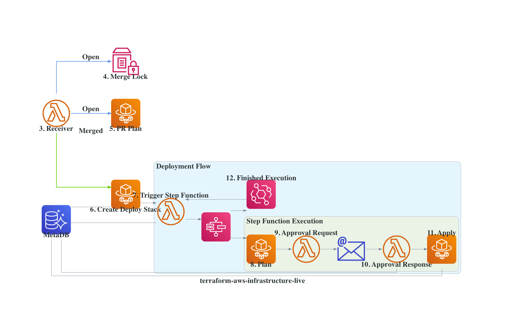

# Terraform AWS Infrastructure Live CI

<!--ts-->
* [Terraform AWS Infrastructure Live CI](#terraform-aws-infrastructure-live-ci)
   * [Problem](#problem)
   * [Solution](#solution)
   * [Design](#design)
   * [Commit Statuses](#commit-statuses)
   * [Step Function Input](#step-function-input)
   * [Rollback New Provider Resources](#rollback-new-provider-resources)
   * [Infrastructure Repository Requirements](#infrastructure-repository-requirements)
   * [Why use AWS Step Function for the deployment flow?](#why-use-aws-step-function-for-the-deployment-flow)
      * [Step Function](#step-function)
         * [Pros](#pros)
      * [CodePipeline](#codepipeline)
         * [Pros](#pros-1)
         * [Cons](#cons)
   * [Pricing](#pricing)
      * [Lambda](#lambda)
      * [ECS](#ecs)
      * [Step Function](#step-function-1)
      * [RDS](#rds)
      * [EventBridge](#eventbridge)
   * [Cost](#cost)
   * [Requirements](#requirements)
   * [Providers](#providers)
   * [Modules](#modules)
   * [Resources](#resources)
   * [Inputs](#inputs)
   * [Outputs](#outputs)
   * [Deploy the Terraform Module](#deploy-the-terraform-module)
      * [CLI Requirements](#cli-requirements)
      * [Steps](#steps)
   * [Testing](#testing)
      * [Docker Environment](#docker-environment)
         * [Requirements](#requirements-1)
         * [Steps](#steps-1)
      * [Local GitHub Actions Workflow](#local-github-actions-workflow)
         * [Requirements](#requirements-2)
         * [Steps](#steps-2)
   * [Pitfalls](#pitfalls)
   * [TODO:](#todo)
      * [Features:](#features)
      * [Improvements:](#improvements)
      * [Think About...](#think-about)

<!-- Added by: root, at: Wed Jul 13 00:41:40 UTC 2022 -->

<!--te-->


## Problem
 
`terragrunt run-all` commands have a limitation of inaccurately outputting the dependency values for child terraform plans if the dependency configuration changes. The current advice is to exclude `terragrunt run-all` from CI systems and run individual `terragrunt` commands within each target directory (see [GitHub issue](https://github.com/gruntwork-io/terragrunt/issues/720#issuecomment-497888756)). This imposes the tedious process of manually determining what directories to run on and the explicit ordering between them within the CI pipeline. As other users of Terragrunt have [stated](https://github.com/gruntwork-io/terragrunt/issues/262
), there's a need for some way to manage the dependency changes before applying the changes that were made within the PR. This module brings an AWS native solution to this problem.
 
 
## Solution
 
Before getting into how the entire module works, we'll dive into the proposed solution to the problem and how it boils down to a specific piece of the CI pipeline. As mentioned above, the `terragrunt run-all` command will produce an inaccurate dependency value for child directories that depend on parent directories that haven't been applied yet. If all parent dependencies were applied beforehand, the dependency value within the child Terraform plan would then be valid. So what if we created a component of a CI pipeline that detects all dependency paths that include changes, runs a separate approval flow for each of those paths, and then runs an approval flow for the child path? This will ensure that every `terragrunt plan` command contains valid dependency values.
 
This module includes two different approaches to detecting changes which we will call "graph scan" and "plan scan". The scan type can be toggled via the `create_deploy_stack_scan_type` Terraform variable. The `graph` scan will initially use the `git diff` command to collect directories that contain .tf or .hcl file changes. Using mapping of the terragrunt directories and their associated dependency list, the script will recursively collect directories that contain dependency changes. The `plan` scan approach will run the command `terragrunt run-all plan -detailed-exitcode` (command is shortened to include only relevant arguments). The `terragrunt run-all plan` portion will traverse from the root terragrunt directory down to every child Terragrunt directory. It will then run `terraform plan -detailed-exitcode` within each directory and output the [exitcode](https://www.terraform.io/cli/commands/plan#detailed-exitcode) that represents whether the plan contains changes or not. If the directory does contain changes, the directory and its associated dependencies that also have changed will be collected. This excludes dependencies that are unchanged but upstream from changed directories. For example, consider the following directory dependency tree:

```
dev/vpc
    \
    dev/rds
        \
        dev/ec2
```
if `dev/rds` and `dev/ec2` have changes, only `dev/rds` and `dev/ec2` will be collected.

After all directories and their associated dependencies are gathered, they are put into separate database records that a downstream Lambda Function will then use. The Lambda Function will determine the order in which the directories are passed into the Step Function deployment flow. This entire process includes no human intervention and removes the need for users to define the deployment ordering all together. The actual code that runs this process is defined [here](./docker/src/create_deploy_stack/create_deploy_stack.py).
 
 
## Design
 

 
1. An GitHub webhook will be created for the target GitHub repository. The webhook will send requests to the AWS API Gateway endpoint on open PR activities or merge PR events. The API will pass the webhook payload to the #2 Lambda Function.

2. The Lambda Function will validate the request's SHA-256 header value with the secret configured within Terraform module. If the request is valid, the function will check if the payload meets the requirements to pass the request to the next Lambda Function. The payload must contain attributes that reflect that the GitHub event was an open PR activity or PR merge, includes .tf and/or .hcl file additions and/or modifications, and has a PR base ref that is the trunk branch (trunk branch represents the live Terraform configurations and should be reflected within the Terraform state files).

3. The Lambda Function acts as a branch that runs different logic depending on the GitHub event. 

    If the Github event was open PR activity, the Lambda Function will collect a list of unique directories that contain new/modified .hcl and/or .tf files. For every directory, the Lambda Function will run an ECS task (#5). In addition to the ECS task(s), the Lambda Function will check if there's a deployment flow in progress and add the check to the PR's commit status. 

    If the Github event was a merged PR, an ECS task named Create Deploy Stack will be run.

4. The Lambda Function will load an AWS System Manager Parameter Store value reference as `merge_lock` that will contain the PR ID of the deployment in progress or `none` if there isn't any in progress. Merging will be locked until the deployment flow is done. Once the deployment flow is finished, the downstream Lambda Function will reset the parameter value (see #7).

    `**NOTE: The PR committer will have to create another commit once the merge lock status is unlocked to get an updated merge lock commit status. **`

5. The ECS task will run a plan on the Terragrunt directory. This will output the Terraform plan to the CloudWatch logs for users to see what resources are proposed to be created, modified, and/or deleted.

6. The task will overwrite the current merge lock value with the associated PR ID. Next, the task will scan the trunk branch for changes made from the PR. The task will insert records into the metadb for each directory that contains differences in its respective Terraform plan. After the records are inserted, the task will invoke the #7 Lambda Function.
 
7. A Lambda Function referenced within the module as `trigger_sf` will select metadb records for Terragrunt directories with account and directory level dependencies met. The Lambda will convert the records into JSON objects and pass each JSON as input into separate Step Function executions. 
 
8. An ECS task referenced as `terra_run` within the module will run the record's associated `plan_command`. This will output the Terraform plan to the CloudWatch logs for users to see what resources will be created, modified, and/or deleted.
 
9. A Lambda Function referenced as `approval_request` within the module will send an email via AWS SES to every email address defined under the record's `voters` attribute. The contents of the email will include metadata about the execution, a link to the Terraform plan, and a very minimal HTML forum for voters to cast their vote.

10. When a voter approves or rejects a deployment, the Lambda Function referenced as `approval_response` will update the records approval or rejection count. Once the minimum approval count is met, the Lambda Function will send a success [task token](https://docs.aws.amazon.com/step-functions/latest/dg/connect-to-resource.html#connect-wait-token) back to the associated Step Function execution.

11. Based on which minimum approval count is met, the `Approval Results` Step Function task will conditionally choose which downstream task to run next. If the rejection count is met, the `Reject` task will run and the Step Function execution will be finished. If the approval count is met, the `terra_run` ECS task will run the record's associated `apply_command`. This Terraform apply output will be displayed within the CloudWatch logs for users to see what resources were created, modified, and/or deleted. If the deployment created new provider resources, the task will update the record's associated `new_resources` attribute with the new provider resource addresses that were created. This [Rollback New Provider Resources](#rollback-new-provider-resources) section below will explain how the `new_resources` attribute will be used. 
 
11. After every Step Function execution, a Cloudwatch event rule will invoke the `trigger_sf` Lambda Function mentioned in step #7. The Lambda Function will update the Step Function execution's associated metadb record status with the Step Function execution status. If the `Success` task of the Step Function was successful, the updated status will be `succeeded` and if the `Reject` task was successful, the updated status will be `failed`.

    The Lambda Function will then repeat the same process as mentioned in step #7 until there are no records that are waiting to be run with a Step Function execution. As stated above, the Lambda Function will update the merge lock status value to allow other Terraform-related PRs to be merged.

## Commit Statuses

Each ECS task with the addition of the merge lock will be available to send commit statuses displaying the current state of the task. The commit statuses can be toggled via the `var.commit_status_config` variable or by manually editing the actual configuration stored on AWS System Manager Parameter Store.

Each of the ECS-related commit statuses will link to the task's associated AWS CloudWatch Log Stream. If the calling service failed to run the task, the service's page or log link will be used.

`** NOTE: Permissions for users (including approval voters) to access the log streams are not managed via this module **`
## Step Function Input
 
Each execution is passed a JSON input that contains record attributes that will help configure the Step Function tasks. A sample JSON input will look like the following:
 
```
{
 "execution_id": "run-1-c8c5-dev-baz-729",
 "is_rollback": false,
 "pr_id": 1,
 "commit_id": "c8c5f6afc7345bd21cd79acaf740dc18b60755e3",
 "base_ref": "refs/heads/master",
 "head_ref": "refs/heads/feature-5320d796-6511-4b05-8adf-47382b46afe2",
 "cfg_path": "directory_dependency/dev-account/us-west-2/env-one/baz",
 "cfg_deps": [
   "directory_dependency/dev-account/global"
 ],
 "status": "running",
 "plan_command": "terragrunt plan --terragrunt-working-dir directory_dependency/dev-account/us-west-2/env-one/baz",
 "apply_command": "terragrunt apply --terragrunt-working-dir directory_dependency/dev-account/us-west-2/env-one/baz -auto-approve",
 "new_providers": ["registry.terraform.io/hashicorp/null"],
 "new_resources": ["null_resource.this"],
 "account_name": "dev",
 "account_path": "directory_dependency/dev-account",
 "account_deps": [
   "shared_services"
 ],
 "voters": [
   "success@simulator.amazonses.com"
 ],
 "approval_voters": [],
 "min_approval_count": 1,
 "rejection_voters": [],
 "min_rejection_count": 1,
 "plan_role_arn": "arn:aws:iam::111111111111:role/terraform-aws-infrastructure-live-ci-plan",
 "apply_role_arn": "arn:aws:iam::111111111111:role/terraform-aws-infrastructure-live-ci-apply"
}
```
 
`execution_id`: An unique identifier that represents the execution name. The ID is formatted to be `run-{pr_id}-{first four digits of commit_id}-{account_name}-{leaf directory of cfg_path}-{random three digits}`. Only three random digits are used because if the record has a long account_name and/or cfg_path, the execution_id may exceed Step Function's 80 characters or less execution name limit.
 
`is_rollback`: Determines if the execution pertains to a deployment that will roll back changes from a previous execution. (See the [Rollback New Provider Resources](#rollback-new-provider-resources) section for more info)
 
`pr_id`: Pull Request Number
 
`commit_id`: Pull Request merge commit ID
 
`base_ref`: Branch that the pull request was merged into
 
`head_ref`: Branch that was merged into the base branch
 
`cfg_path`: A directories relative path to the GitHub repository's root path
 
`cfg_deps`: List of `cfg_path` directories that this `cfg_path` depends on. Dependencies are defined via Terragrunt dependencies blocks (see this [Terragrunt page](https://terragrunt.gruntwork.io/docs/reference/config-blocks-and-attributes/#dependencies) for more info)
 
`status`: Status of the Step Function execution. Statuses can be `waiting|running|succeeded|failed|aborted`
 
`plan_command`: Terragrunt command used to display the Terraform plan within the Step Function `Plan` task
 
`apply_command`: Terragrunt command used to apply the Terraform configurations within the Step Function `Apply` task
 
`new_providers`: List of new providers introduced by the pull request (See the [Rollback New Provider Resources](#rollback-new-provider-resources) section for more info)
 
`new_resources`: List of new provider resources that were deployed  (See the [Rollback New Provider Resources](#rollback-new-provider-resources) section for more info)
 
`account_name`: AWS account the `cfg_path` will deploy resources to
 
`account_deps`: List of AWS accounts (`account_name`) the record's `account_name` depends on
 
`voters`: List of email addresses to send an approval request to
 
`approval_voters`: List of `voters` who have approved the deployment
 
`min_approval_count`: Minimum number of approvals needed to deploy
 
`rejection_voters`: List of `voters` who have rejected the deployment
 
`min_rejection_count`: Minimum number of rejections needed to decline the deployment
 
`plan_role_arn`: AWS IAM role ARN used to run `plan_command`
 
`apply_role_arn`: AWS IAM role ARN used to run `apply_command`
 
## Rollback New Provider Resources
 
Let us say a PR introduces a new provider and resource block. The PR is merged and the deployment associated with the new provider resource succeeds. For some reason, a downstream deployment fails and the entire PR needs to be reverted. The revert PR is created and merged. The directory containing the new provider resource will be non-existent within the revert PR although the terraform state file associated with the directory will still contain the new provider resources. Given that the provider block and its associated provider credentials are gone, Terraform will output an error when trying to initialize the directory within the deployment flow. This type of scenario is also referenced in this [StackOverflow post](https://stackoverflow.com/a/57829202/12659025).
 
To handle this scenario, the CI pipeline will document which directories define new provider resources within the metadb. After every deployment, any new provider resources that were deployed will also be documented. If any deployment flow fails, the CI pipeline will start Step Function executions for every directory that contains new providers with `-target` flags to destroy the new provider resources. To see it in action, run the [test_rollback_providers.py](./tests/integration/test_rollback_providers.py) test.

## Infrastructure Repository Requirements
 
- Terraform files can be present but they must be referenced by Terragrunt configurations for them to be detected by the CI workflow
- Configuration can't depend on environment variables that are not already passed to the tasks
 
## Why use AWS Step Function for the deployment flow?
 
It would seem like CodePipeline would be the go-to AWS service for hosting the deployment workflow. After a long period of trying both, I found the following trade-offs.
 
### Step Function
 
#### Pros
 
- Ability to handle complex conditional workflows by using [choice states](https://docs.aws.amazon.com/step-functions/latest/dg/amazon-states-language-choice-state.html)
- Ability to capture errors and define fallback states (see [here](https://docs.aws.amazon.com/step-functions/latest/dg/concepts-error-handling.html) for more info)
- Updates to the workflow in itself will not fail the current execution and changes will be reflected within future executions [(reference)](https://docs.aws.amazon.com/step-functions/latest/dg/getting-started.html#update-state-machine-step-3
)
- Ability to customize the execution name which is useful in searching for executions within the console
 
### CodePipeline
 
#### Pros
 
- Integrated approval flow managed via IAM users/roles
- Simple and intuitive GUI
- Satisfied with just being able to do account-level execution concurrency
- A single AWS account with a simple plan, approval, and deploy workflow is only needed
 
#### Cons
 
- Can't handle complex task branching. The current implementation is fairly simple but newer versions of this module may contain feature Step Function definitions that handle complex deployment workflows.
- Concurrent runs are not available which can lead to slow deployment rollouts for changes within deeply rooted dependencies or changes within a large number of independent sibling directories
- Updates to the pipeline in itself causes the execution to fail and prevent any downstream actions from running as described [here](https://docs.aws.amazon.com/codepipeline/latest/userguide/pipelines-edit.html
)
- Free tier only allows for one free pipeline a month. After the free tier, the cost for each active pipeline is $1 a month not including the additional charges for storing the CodePipeline artifacts within S3. Given that this module is intended for handling a large amount of AWS accounts, a CodePipeline for each account would be necessary which would spike up the total cost of running this module.
 
## Pricing
 
### Lambda
 
The AWS Lambda free tier includes one million free requests per month and 400,000 GB seconds of computing time per month. Given the use of the Lambda Functions are revolved around infrastructure changes, the total amount of invocations will likely be minimal and will probably chip away only a tiny fraction of the free tier allocation.
 
### ECS

AWS ECS Fargate does not have a free tier. The cost of running the tasks will depend on the resource configurations and duration of the tasks. Each of the tasks' CPU, memory, and storage capacity can be declared within the module and should be tuned to your needs. It's important to consider having a larger memory capacity for the create deploy stack task given the task is running queries on the metadb that loads the query results into memory. The terra run apply tasks do run an insert query but don't require larger resources. See Terraform's recommendations [here](https://www.terraform.io/enterprise/system-overview/capacity).
 
### Step Function

The cost for the Step Function machine is based on state transitions. Luckily 4,000 state transitions per month are covered under the free tier. The Step Function definition contains only a minimal amount of state transitions. Unless the infrastructure repo contains frequent and deeply rooted dependency changes, the free tier limit will likely never be exceeded.
 
### RDS
 
The metadb uses a [Aurora Serverless](https://aws.amazon.com/rds/aurora/serverless/) PostgreSQL database type. Essentially a serverless database will allow users to only pay when the database is in use and free up users from managing the database capacity given that it will automatically scale based on demand. The serverless type is beneficial for this use case given that the metadb is only used within CI services after a PR merge event. Since this module is dealing with live infrastructure and not application changes, there will likely be long periods between PR merges. The serverless database starts with one ACU (Aurora Capacity Units) which contains two GB of memory. The use of the database is likely never to scale beyond using two GB of memory so using one ACU will likely be constant.
 
### EventBridge
 
Given that EventBridge rules and event deliveries are free, the Step Function execution rule and event delivery to the Lambda Function produces at no cost.


## Cost

Cost estimate in the us-west-2 region via [Infracost](https://github.com/infracost/infracost):

```
 Name                                                                                            Monthly Qty  Unit                        Monthly Cost 
                                                                                                                                                       
 aws_api_gateway_rest_api.this                                                                                                                         
 └─ Requests (first 333M)                                                                Monthly cost depends on usage: $3.50 per 1M requests          
                                                                                                                                                       
 aws_cloudwatch_log_group.ecs_tasks                                                                                                                    
 ├─ Data ingested                                                                        Monthly cost depends on usage: $0.50 per GB                   
 ├─ Archival Storage                                                                     Monthly cost depends on usage: $0.03 per GB                   
 └─ Insights queries data scanned                                                        Monthly cost depends on usage: $0.005 per GB                  
                                                                                                                                                       
 aws_rds_cluster.metadb                                                                                                                                
 ├─ Aurora serverless                                                                    Monthly cost depends on usage: $0.06 per ACU-hours            
 ├─ Storage                                                                              Monthly cost depends on usage: $0.10 per GB                   
 ├─ I/O requests                                                                         Monthly cost depends on usage: $0.20 per 1M requests          
 └─ Snapshot export                                                                      Monthly cost depends on usage: $0.01 per GB                   
                                                                                                                                                       
 aws_secretsmanager_secret.ci_metadb_user                                                                                                              
 ├─ Secret                                                                                                 1  months                             $0.40 
 └─ API requests                                                                         Monthly cost depends on usage: $0.05 per 10k requests         
                                                                                                                                                       
 aws_secretsmanager_secret.master_metadb_user                                                                                                          
 ├─ Secret                                                                                                 1  months                             $0.40 
 └─ API requests                                                                         Monthly cost depends on usage: $0.05 per 10k requests         
                                                                                                                                                       
 aws_sfn_state_machine.this                                                                                                                            
 └─ Transitions                                                                          Monthly cost depends on usage: $0.025 per 1K transitions      
                                                                                                                                                       
 module.github_webhook_validator.aws_cloudwatch_log_group.agw[0]                                                                                       
 ├─ Data ingested                                                                        Monthly cost depends on usage: $0.50 per GB                   
 ├─ Archival Storage                                                                     Monthly cost depends on usage: $0.03 per GB                   
 └─ Insights queries data scanned                                                        Monthly cost depends on usage: $0.005 per GB                  
                                                                                                                                                       
 module.github_webhook_validator.module.lambda_function.aws_cloudwatch_log_group.lambda                                                                
 ├─ Data ingested                                                                        Monthly cost depends on usage: $0.50 per GB                   
 ├─ Archival Storage                                                                     Monthly cost depends on usage: $0.03 per GB                   
 └─ Insights queries data scanned                                                        Monthly cost depends on usage: $0.005 per GB                  
                                                                                                                                                       
 module.github_webhook_validator.module.lambda_function.aws_lambda_function.this                                                                       
 ├─ Requests                                                                             Monthly cost depends on usage: $0.20 per 1M requests          
 └─ Duration                                                                             Monthly cost depends on usage: $0.0000166667 per GB-seconds   
                                                                                                                                                       
 module.lambda_approval_request.aws_cloudwatch_log_group.this[0]                                                                                       
 ├─ Data ingested                                                                        Monthly cost depends on usage: $0.50 per GB                   
 ├─ Archival Storage                                                                     Monthly cost depends on usage: $0.03 per GB                   
 └─ Insights queries data scanned                                                        Monthly cost depends on usage: $0.005 per GB                  
                                                                                                                                                       
 module.lambda_approval_request.aws_lambda_function.this[0]                                                                                            
 ├─ Requests                                                                             Monthly cost depends on usage: $0.20 per 1M requests          
 └─ Duration                                                                             Monthly cost depends on usage: $0.0000166667 per GB-seconds   
                                                                                                                                                       
 module.lambda_approval_response.aws_cloudwatch_log_group.this[0]                                                                                      
 ├─ Data ingested                                                                        Monthly cost depends on usage: $0.50 per GB                   
 ├─ Archival Storage                                                                     Monthly cost depends on usage: $0.03 per GB                   
 └─ Insights queries data scanned                                                        Monthly cost depends on usage: $0.005 per GB                  
                                                                                                                                                       
 module.lambda_approval_response.aws_lambda_function.this[0]                                                                                           
 ├─ Requests                                                                             Monthly cost depends on usage: $0.20 per 1M requests          
 └─ Duration                                                                             Monthly cost depends on usage: $0.0000166667 per GB-seconds   
                                                                                                                                                       
 module.lambda_trigger_sf.aws_cloudwatch_log_group.this[0]                                                                                             
 ├─ Data ingested                                                                        Monthly cost depends on usage: $0.50 per GB                   
 ├─ Archival Storage                                                                     Monthly cost depends on usage: $0.03 per GB                   
 └─ Insights queries data scanned                                                        Monthly cost depends on usage: $0.005 per GB                  
                                                                                                                                                       
 module.lambda_trigger_sf.aws_lambda_function.this[0]                                                                                                  
 ├─ Requests                                                                             Monthly cost depends on usage: $0.20 per 1M requests          
 └─ Duration                                                                             Monthly cost depends on usage: $0.0000166667 per GB-seconds   
                                                                                                                                                       
 module.lambda_webhook_receiver.aws_cloudwatch_log_group.this[0]                                                                                       
 ├─ Data ingested                                                                        Monthly cost depends on usage: $0.50 per GB                   
 ├─ Archival Storage                                                                     Monthly cost depends on usage: $0.03 per GB                   
 └─ Insights queries data scanned                                                        Monthly cost depends on usage: $0.005 per GB                  
                                                                                                                                                       
 module.lambda_webhook_receiver.aws_lambda_function.this[0]                                                                                            
 ├─ Requests                                                                             Monthly cost depends on usage: $0.20 per 1M requests          
 └─ Duration                                                                             Monthly cost depends on usage: $0.0000166667 per GB-seconds   
                                                                                                                                                       
 OVERALL TOTAL                                                                                                                                   $0.80 
──────────────────────────────────
133 cloud resources were detected:
∙ 17 were estimated, all of which include usage-based costs, see https://infracost.io/usage-file
∙ 106 were free:
  ∙ 31 x aws_iam_role_policy_attachment
  ∙ 22 x aws_iam_policy
  ∙ 9 x aws_iam_role
  ∙ 7 x aws_ssm_parameter
  ∙ 5 x aws_lambda_permission
  ∙ 4 x aws_api_gateway_method_response
  ∙ 4 x aws_lambda_layer_version
  ∙ 3 x aws_ecs_task_definition
  ∙ 2 x aws_api_gateway_integration
  ∙ 2 x aws_api_gateway_method
  ∙ 2 x aws_api_gateway_method_settings
  ∙ 2 x aws_api_gateway_resource
  ∙ 2 x aws_cloudwatch_event_rule
  ∙ 2 x aws_cloudwatch_event_target
  ∙ 2 x aws_secretsmanager_secret_version
  ∙ 1 x aws_api_gateway_account
  ∙ 1 x aws_api_gateway_deployment
  ∙ 1 x aws_api_gateway_model
  ∙ 1 x aws_api_gateway_stage
  ∙ 1 x aws_ecs_cluster
  ∙ 1 x aws_lambda_event_source_mapping
  ∙ 1 x aws_lambda_function_event_invoke_config
∙ 10 are not supported yet, see https://infracost.io/requested-resources:
  ∙ 4 x aws_api_gateway_integration_response
  ∙ 1 x aws_lambda_function_url
  ∙ 1 x aws_lambda_provisioned_concurrency_config
  ∙ 1 x aws_s3_object
  ∙ 1 x aws_ses_email_identity
  ∙ 1 x aws_ses_identity_policy
  ∙ 1 x aws_ses_template
```
 
<!-- BEGINNING OF PRE-COMMIT-TERRAFORM DOCS HOOK -->
## Requirements

| Name | Version |
|------|---------|
| <a name="requirement_terraform"></a> [terraform](#requirement\_terraform) | >= 0.14.0 |
| <a name="requirement_aws"></a> [aws](#requirement\_aws) | >= 3.44 |
| <a name="requirement_github"></a> [github](#requirement\_github) | >= 4.0 |
| <a name="requirement_random"></a> [random](#requirement\_random) | >=3.2.0 |

## Providers

| Name | Version |
|------|---------|
| <a name="provider_aws"></a> [aws](#provider\_aws) | >= 3.44 |
| <a name="provider_github"></a> [github](#provider\_github) | >= 4.0 |
| <a name="provider_null"></a> [null](#provider\_null) | n/a |
| <a name="provider_random"></a> [random](#provider\_random) | >=3.2.0 |

## Modules

| Name | Source | Version |
|------|--------|---------|
| <a name="module_apply_role"></a> [apply\_role](#module\_apply\_role) | github.com/marshall7m/terraform-aws-iam//modules/iam-role | v0.1.0 |
| <a name="module_create_deploy_stack_role"></a> [create\_deploy\_stack\_role](#module\_create\_deploy\_stack\_role) | github.com/marshall7m/terraform-aws-iam//modules/iam-role | v0.1.0 |
| <a name="module_cw_event_rule_role"></a> [cw\_event\_rule\_role](#module\_cw\_event\_rule\_role) | github.com/marshall7m/terraform-aws-iam//modules/iam-role | v0.1.0 |
| <a name="module_cw_event_terra_run"></a> [cw\_event\_terra\_run](#module\_cw\_event\_terra\_run) | github.com/marshall7m/terraform-aws-iam//modules/iam-role | v0.1.0 |
| <a name="module_ecs_execution_role"></a> [ecs\_execution\_role](#module\_ecs\_execution\_role) | github.com/marshall7m/terraform-aws-iam//modules/iam-role | v0.1.0 |
| <a name="module_lambda_approval_request"></a> [lambda\_approval\_request](#module\_lambda\_approval\_request) | terraform-aws-modules/lambda/aws | 3.3.1 |
| <a name="module_lambda_approval_response"></a> [lambda\_approval\_response](#module\_lambda\_approval\_response) | terraform-aws-modules/lambda/aws | 3.3.1 |
| <a name="module_lambda_trigger_sf"></a> [lambda\_trigger\_sf](#module\_lambda\_trigger\_sf) | terraform-aws-modules/lambda/aws | 3.3.1 |
| <a name="module_lambda_webhook_receiver"></a> [lambda\_webhook\_receiver](#module\_lambda\_webhook\_receiver) | terraform-aws-modules/lambda/aws | 3.3.1 |
| <a name="module_plan_role"></a> [plan\_role](#module\_plan\_role) | github.com/marshall7m/terraform-aws-iam//modules/iam-role | v0.1.0 |
| <a name="module_sf_role"></a> [sf\_role](#module\_sf\_role) | github.com/marshall7m/terraform-aws-iam//modules/iam-role | v0.1.0 |

## Resources

| Name | Type |
|------|------|
| [aws_cloudwatch_event_rule.ecs_terra_run](https://registry.terraform.io/providers/hashicorp/aws/latest/docs/resources/cloudwatch_event_rule) | resource |
| [aws_cloudwatch_event_rule.sf_execution](https://registry.terraform.io/providers/hashicorp/aws/latest/docs/resources/cloudwatch_event_rule) | resource |
| [aws_cloudwatch_event_target.sf_execution](https://registry.terraform.io/providers/hashicorp/aws/latest/docs/resources/cloudwatch_event_target) | resource |
| [aws_cloudwatch_event_target.terra_run](https://registry.terraform.io/providers/hashicorp/aws/latest/docs/resources/cloudwatch_event_target) | resource |
| [aws_cloudwatch_log_group.ecs_tasks](https://registry.terraform.io/providers/hashicorp/aws/latest/docs/resources/cloudwatch_log_group) | resource |
| [aws_ecs_cluster.this](https://registry.terraform.io/providers/hashicorp/aws/latest/docs/resources/ecs_cluster) | resource |
| [aws_ecs_task_definition.create_deploy_stack](https://registry.terraform.io/providers/hashicorp/aws/latest/docs/resources/ecs_task_definition) | resource |
| [aws_ecs_task_definition.plan](https://registry.terraform.io/providers/hashicorp/aws/latest/docs/resources/ecs_task_definition) | resource |
| [aws_ecs_task_definition.terra_run](https://registry.terraform.io/providers/hashicorp/aws/latest/docs/resources/ecs_task_definition) | resource |
| [aws_iam_policy.approval_response](https://registry.terraform.io/providers/hashicorp/aws/latest/docs/resources/iam_policy) | resource |
| [aws_iam_policy.ci_metadb_access](https://registry.terraform.io/providers/hashicorp/aws/latest/docs/resources/iam_policy) | resource |
| [aws_iam_policy.commit_status_config](https://registry.terraform.io/providers/hashicorp/aws/latest/docs/resources/iam_policy) | resource |
| [aws_iam_policy.github_token_ssm_read_access](https://registry.terraform.io/providers/hashicorp/aws/latest/docs/resources/iam_policy) | resource |
| [aws_iam_policy.lambda_approval_request](https://registry.terraform.io/providers/hashicorp/aws/latest/docs/resources/iam_policy) | resource |
| [aws_iam_policy.merge_lock_ssm_param_full_access](https://registry.terraform.io/providers/hashicorp/aws/latest/docs/resources/iam_policy) | resource |
| [aws_iam_policy.trigger_sf](https://registry.terraform.io/providers/hashicorp/aws/latest/docs/resources/iam_policy) | resource |
| [aws_iam_policy.webhook_receiver](https://registry.terraform.io/providers/hashicorp/aws/latest/docs/resources/iam_policy) | resource |
| [aws_rds_cluster.metadb](https://registry.terraform.io/providers/hashicorp/aws/latest/docs/resources/rds_cluster) | resource |
| [aws_secretsmanager_secret.ci_metadb_user](https://registry.terraform.io/providers/hashicorp/aws/latest/docs/resources/secretsmanager_secret) | resource |
| [aws_secretsmanager_secret.master_metadb_user](https://registry.terraform.io/providers/hashicorp/aws/latest/docs/resources/secretsmanager_secret) | resource |
| [aws_secretsmanager_secret.registry](https://registry.terraform.io/providers/hashicorp/aws/latest/docs/resources/secretsmanager_secret) | resource |
| [aws_secretsmanager_secret_version.ci_metadb_user](https://registry.terraform.io/providers/hashicorp/aws/latest/docs/resources/secretsmanager_secret_version) | resource |
| [aws_secretsmanager_secret_version.master_metadb_user](https://registry.terraform.io/providers/hashicorp/aws/latest/docs/resources/secretsmanager_secret_version) | resource |
| [aws_secretsmanager_secret_version.registry](https://registry.terraform.io/providers/hashicorp/aws/latest/docs/resources/secretsmanager_secret_version) | resource |
| [aws_ses_email_identity.approval](https://registry.terraform.io/providers/hashicorp/aws/latest/docs/resources/ses_email_identity) | resource |
| [aws_ses_identity_policy.approval](https://registry.terraform.io/providers/hashicorp/aws/latest/docs/resources/ses_identity_policy) | resource |
| [aws_ses_template.approval](https://registry.terraform.io/providers/hashicorp/aws/latest/docs/resources/ses_template) | resource |
| [aws_sfn_state_machine.this](https://registry.terraform.io/providers/hashicorp/aws/latest/docs/resources/sfn_state_machine) | resource |
| [aws_ssm_parameter.commit_status_config](https://registry.terraform.io/providers/hashicorp/aws/latest/docs/resources/ssm_parameter) | resource |
| [aws_ssm_parameter.email_approval_secret](https://registry.terraform.io/providers/hashicorp/aws/latest/docs/resources/ssm_parameter) | resource |
| [aws_ssm_parameter.github_token](https://registry.terraform.io/providers/hashicorp/aws/latest/docs/resources/ssm_parameter) | resource |
| [aws_ssm_parameter.github_webhook_secret](https://registry.terraform.io/providers/hashicorp/aws/latest/docs/resources/ssm_parameter) | resource |
| [aws_ssm_parameter.merge_lock](https://registry.terraform.io/providers/hashicorp/aws/latest/docs/resources/ssm_parameter) | resource |
| [aws_ssm_parameter.metadb_ci_password](https://registry.terraform.io/providers/hashicorp/aws/latest/docs/resources/ssm_parameter) | resource |
| [aws_ssm_parameter.scan_type](https://registry.terraform.io/providers/hashicorp/aws/latest/docs/resources/ssm_parameter) | resource |
| [aws_ssm_parameter.webhook_filter_groups](https://registry.terraform.io/providers/hashicorp/aws/latest/docs/resources/ssm_parameter) | resource |
| [github_branch_protection.merge_lock](https://registry.terraform.io/providers/integrations/github/latest/docs/resources/branch_protection) | resource |
| [github_repository_webhook.this](https://registry.terraform.io/providers/integrations/github/latest/docs/resources/repository_webhook) | resource |
| [null_resource.metadb_setup](https://registry.terraform.io/providers/hashicorp/null/latest/docs/resources/resource) | resource |
| [random_id.metadb_users](https://registry.terraform.io/providers/hashicorp/random/latest/docs/resources/id) | resource |
| [random_password.email_approval_secret](https://registry.terraform.io/providers/hashicorp/random/latest/docs/resources/password) | resource |
| [random_password.github_webhook_secret](https://registry.terraform.io/providers/hashicorp/random/latest/docs/resources/password) | resource |
| [aws_caller_identity.current](https://registry.terraform.io/providers/hashicorp/aws/latest/docs/data-sources/caller_identity) | data source |
| [aws_iam_policy_document.approval](https://registry.terraform.io/providers/hashicorp/aws/latest/docs/data-sources/iam_policy_document) | data source |
| [aws_iam_policy_document.approval_response](https://registry.terraform.io/providers/hashicorp/aws/latest/docs/data-sources/iam_policy_document) | data source |
| [aws_iam_policy_document.ci_metadb_access](https://registry.terraform.io/providers/hashicorp/aws/latest/docs/data-sources/iam_policy_document) | data source |
| [aws_iam_policy_document.commit_status_config](https://registry.terraform.io/providers/hashicorp/aws/latest/docs/data-sources/iam_policy_document) | data source |
| [aws_iam_policy_document.github_token_ssm_read_access](https://registry.terraform.io/providers/hashicorp/aws/latest/docs/data-sources/iam_policy_document) | data source |
| [aws_iam_policy_document.lambda_approval_request](https://registry.terraform.io/providers/hashicorp/aws/latest/docs/data-sources/iam_policy_document) | data source |
| [aws_iam_policy_document.merge_lock_ssm_param_full_access](https://registry.terraform.io/providers/hashicorp/aws/latest/docs/data-sources/iam_policy_document) | data source |
| [aws_iam_policy_document.trigger_sf](https://registry.terraform.io/providers/hashicorp/aws/latest/docs/data-sources/iam_policy_document) | data source |
| [aws_iam_policy_document.webhook_receiver](https://registry.terraform.io/providers/hashicorp/aws/latest/docs/data-sources/iam_policy_document) | data source |
| [aws_region.current](https://registry.terraform.io/providers/hashicorp/aws/latest/docs/data-sources/region) | data source |
| [aws_ses_email_identity.approval](https://registry.terraform.io/providers/hashicorp/aws/latest/docs/data-sources/ses_email_identity) | data source |
| [aws_ssm_parameter.github_token](https://registry.terraform.io/providers/hashicorp/aws/latest/docs/data-sources/ssm_parameter) | data source |
| [github_repository.this](https://registry.terraform.io/providers/integrations/github/latest/docs/data-sources/repository) | data source |

## Inputs

| Name | Description | Type | Default | Required |
|------|-------------|------|---------|:--------:|
| <a name="input_account_parent_cfg"></a> [account\_parent\_cfg](#input\_account\_parent\_cfg) | AWS account-level configurations.<br>  - name: AWS account name (e.g. dev, staging, prod, etc.)<br>  - path: Parent account directory path relative to the repository's root directory path (e.g. infrastructure-live/dev-account)<br>  - voters: List of email addresses that will be sent approval request to<br>  - min\_approval\_count: Minimum approval count needed for CI pipeline to run deployment<br>  - min\_rejection\_count: Minimum rejection count needed for CI pipeline to decline deployment<br>  - dependencies: List of AWS account names that this account depends on before running any of it's deployments <br>    - For example, if the `dev` account depends on the `shared-services` account and both accounts contain infrastructure changes within a PR (rare scenario but possible),<br>      all deployments that resolve infrastructure changes within `shared-services` need to be applied before any `dev` deployments are executed. This is useful given a<br>      scenario where resources within the `dev` account are explicitly dependent on resources within the `shared-serives` account.<br>  - plan\_role\_arn: IAM role ARN within the account that the plan build will assume<br>    - **CAUTION: Do not give the plan role broad administrative permissions as that could lead to detrimental results if the build was compromised**<br>  - apply\_role\_arn: IAM role ARN within the account that the deploy build will assume<br>    - Fine-grained permissions for each Terragrunt directory within the account can be used by defining a before\_hook block that<br>      conditionally defines that assume\_role block within the directory dependant on the Terragrunt command. For example within `prod/iam/terragrunt.hcl`,<br>      define a before hook block that passes a strict read-only role ARN for `terragrunt plan` commands and a strict write role ARN for `terragrunt apply`. Then<br>      within the `apply_role_arn` attribute here, define a IAM role that can assume both of these roles. | <pre>list(object({<br>    name                = string<br>    path                = string<br>    voters              = list(string)<br>    min_approval_count  = number<br>    min_rejection_count = number<br>    dependencies        = list(string)<br>    plan_role_arn       = string<br>    apply_role_arn      = string<br>  }))</pre> | n/a | yes |
| <a name="input_api_stage_name"></a> [api\_stage\_name](#input\_api\_stage\_name) | API deployment stage name | `string` | `"prod"` | no |
| <a name="input_approval_request_sender_email"></a> [approval\_request\_sender\_email](#input\_approval\_request\_sender\_email) | Email address to use for sending approval requests | `string` | n/a | yes |
| <a name="input_base_branch"></a> [base\_branch](#input\_base\_branch) | Base branch for repository that all PRs will compare to | `string` | `"master"` | no |
| <a name="input_commit_status_config"></a> [commit\_status\_config](#input\_commit\_status\_config) | Determine which commit statuses should be sent for each of the specified pipeline components. <br>The commit status will contain the current state (e.g pending, success, failure) and will link to <br>the component's associated AWS console page.<br><br>Each of the following descriptions specify where and what the commit status links to:<br><br>PrPlan: CloudWatch log stream displaying the Terraform plan for a directory within the open pull request<br>CreateDeployStack: CloudWatch log stream displaying the execution metadb records that were created for <br>  the merged pull request<br>Plan: CloudWatch log stream displaying the Terraform plan for a directory within the merged pull request<br>Apply: CloudWatch log stream displaying the Terraform apply output for a directory within the merged pull request<br>Execution: AWS Step Function page for the deployment flow execution | <pre>object({<br>    PrPlan            = optional(bool)<br>    CreateDeployStack = optional(bool)<br>    Plan              = optional(bool)<br>    Apply             = optional(bool)<br>    Execution         = optional(bool)<br>  })</pre> | `{}` | no |
| <a name="input_create_deploy_stack_cpu"></a> [create\_deploy\_stack\_cpu](#input\_create\_deploy\_stack\_cpu) | Number of CPU units the create deploy stack task will use. <br>See for more info: https://docs.aws.amazon.com/AmazonECS/latest/developerguide/task-cpu-memory-error.html | `number` | `256` | no |
| <a name="input_create_deploy_stack_memory"></a> [create\_deploy\_stack\_memory](#input\_create\_deploy\_stack\_memory) | Amount of memory (MiB) the create deploy stack task will use. <br>See for more info: https://docs.aws.amazon.com/AmazonECS/latest/developerguide/task-cpu-memory-error.html | `string` | `512` | no |
| <a name="input_create_deploy_stack_scan_type"></a> [create\_deploy\_stack\_scan\_type](#input\_create\_deploy\_stack\_scan\_type) | If set to `graph`, the create\_deploy\_stack build will use the git detected differences to determine what directories to run Step Function executions for.<br>If set to `plan`, the build will use terragrunt run-all plan detected differences to determine the executions.<br>Set to `plan` if changes to the terraform resources are also being controlled outside of the repository (e.g AWS console, separate CI pipeline, etc.)<br>which results in need to refresh the terraform remote state to accurately detect changes.<br>Otherwise set to `graph`, given that collecting changes via git will be significantly faster than collecting changes via terragrunt run-all plan. | `string` | `"graph"` | no |
| <a name="input_create_deploy_stack_status_check_name"></a> [create\_deploy\_stack\_status\_check\_name](#input\_create\_deploy\_stack\_status\_check\_name) | Name of the create deploy stack GitHub status | `string` | `"Create Deploy Stack"` | no |
| <a name="input_create_github_token_ssm_param"></a> [create\_github\_token\_ssm\_param](#input\_create\_github\_token\_ssm\_param) | Determines if the merge lock AWS SSM Parameter Store value should be created | `bool` | n/a | yes |
| <a name="input_create_private_registry_secret"></a> [create\_private\_registry\_secret](#input\_create\_private\_registry\_secret) | Determines if the module should create the AWS Secret Manager resource used for private registry authentification | `bool` | `true` | no |
| <a name="input_ecs_image_address"></a> [ecs\_image\_address](#input\_ecs\_image\_address) | Docker registry image to use for the ECS Fargate containers. If not specified, this Terraform module's GitHub registry image<br>will be used with the tag associated with the version of this module. | `string` | `null` | no |
| <a name="input_ecs_private_subnet_ids"></a> [ecs\_private\_subnet\_ids](#input\_ecs\_private\_subnet\_ids) | AWS VPC private subnet IDs to host the ECS container instances within.<br>Subnets should deny all inbound access and allow the minimum outbound access needed to pull<br>the container image and make API calls to Terraform provider resources.<br>The subnets should be associated with the VPC ID specified under `var.ecs_vpc_id` | `list(string)` | n/a | yes |
| <a name="input_ecs_security_group_ids"></a> [ecs\_security\_group\_ids](#input\_ecs\_security\_group\_ids) | A maximum list of five AWS VPC security group IDs to attach to all ECS tasks. At a minimum, one of the security groups should have<br>an egress rules that allows HTTP/HTTPS access. This gives the task the ability to pull it's associated Docker registry<br>image and download Terraform provider resources. If not specified, the ECS task will use the VPC's default security group. | `list(string)` | `[]` | no |
| <a name="input_ecs_task_logs_retention_in_days"></a> [ecs\_task\_logs\_retention\_in\_days](#input\_ecs\_task\_logs\_retention\_in\_days) | Number of days the ECS task logs will be retained | `number` | `14` | no |
| <a name="input_ecs_tasks_common_env_vars"></a> [ecs\_tasks\_common\_env\_vars](#input\_ecs\_tasks\_common\_env\_vars) | Common env vars defined within all ECS tasks. Useful for setting Terragrunt specific env vars required to run Terragrunt commands. | <pre>list(object({<br>    name  = string<br>    value = string<br>  }))</pre> | `[]` | no |
| <a name="input_ecs_vpc_id"></a> [ecs\_vpc\_id](#input\_ecs\_vpc\_id) | AWS VPC ID to host the ECS container instances within.<br>The VPC should be associated with the subnet IDs specified under `var.ecs_private_subnet_ids` | `string` | n/a | yes |
| <a name="input_enable_branch_protection"></a> [enable\_branch\_protection](#input\_enable\_branch\_protection) | Determines if the branch protection rule is created. If the repository is private (most likely), the GitHub account associated with<br>the GitHub provider must be registered as a GitHub Pro, GitHub Team, GitHub Enterprise Cloud, or GitHub Enterprise Server account. See here for details: https://docs.github.com/en/repositories/configuring-branches-and-merges-in-your-repository/defining-the-mergeability-of-pull-requests/about-protected-branches | `bool` | `true` | no |
| <a name="input_enforce_admin_branch_protection"></a> [enforce\_admin\_branch\_protection](#input\_enforce\_admin\_branch\_protection) | Determines if the branch protection rule is enforced for the GitHub repository's admins. <br>  This essentially gives admins permission to force push to the trunk branch and can allow their infrastructure-related commits to bypass the CI pipeline. | `bool` | `false` | no |
| <a name="input_file_path_pattern"></a> [file\_path\_pattern](#input\_file\_path\_pattern) | Regex pattern to match webhook modified/new files to. Defaults to any file with `.hcl` or `.tf` extension. | `string` | `".+\\.(hcl|tf)$\n"` | no |
| <a name="input_github_token_ssm_description"></a> [github\_token\_ssm\_description](#input\_github\_token\_ssm\_description) | Github token SSM parameter description | `string` | `"Github token used by Merge Lock Lambda Function"` | no |
| <a name="input_github_token_ssm_key"></a> [github\_token\_ssm\_key](#input\_github\_token\_ssm\_key) | AWS SSM Parameter Store key for sensitive Github personal token used by the Merge Lock Lambda Function | `string` | `null` | no |
| <a name="input_github_token_ssm_tags"></a> [github\_token\_ssm\_tags](#input\_github\_token\_ssm\_tags) | Tags for Github token SSM parameter | `map(string)` | `{}` | no |
| <a name="input_github_token_ssm_value"></a> [github\_token\_ssm\_value](#input\_github\_token\_ssm\_value) | Registered Github webhook token associated with the Github provider. The token will be used by the Merge Lock Lambda Function.<br>If not provided, module looks for pre-existing SSM parameter via `var.github_token_ssm_key`".<br>GitHub token needs the `repo` permission to send commit statuses for private repos. (see more about OAuth scopes here: https://docs.github.com/en/developers/apps/building-oauth-apps/scopes-for-oauth-apps) | `string` | `""` | no |
| <a name="input_lambda_approval_request_vpc_config"></a> [lambda\_approval\_request\_vpc\_config](#input\_lambda\_approval\_request\_vpc\_config) | VPC configuration for Lambda approval request function.<br>Ensure that the configuration allows for outgoing HTTPS traffic. | <pre>object({<br>    subnet_ids         = list(string)<br>    security_group_ids = list(string)<br>  })</pre> | `null` | no |
| <a name="input_lambda_approval_response_vpc_config"></a> [lambda\_approval\_response\_vpc\_config](#input\_lambda\_approval\_response\_vpc\_config) | VPC configuration for Lambda approval response function.<br>Ensure that the configuration allows for outgoing HTTPS traffic. | <pre>object({<br>    subnet_ids         = list(string)<br>    security_group_ids = list(string)<br>  })</pre> | `null` | no |
| <a name="input_lambda_trigger_sf_vpc_config"></a> [lambda\_trigger\_sf\_vpc\_config](#input\_lambda\_trigger\_sf\_vpc\_config) | VPC configuration for Lambda trigger\_sf function.<br>Ensure that the configuration allows for outgoing HTTPS traffic. | <pre>object({<br>    subnet_ids         = list(string)<br>    security_group_ids = list(string)<br>  })</pre> | `null` | no |
| <a name="input_lambda_webhook_receiver_vpc_config"></a> [lambda\_webhook\_receiver\_vpc\_config](#input\_lambda\_webhook\_receiver\_vpc\_config) | VPC configuration for Lambda webhook\_receiver function.<br>Ensure that the configuration allows for outgoing HTTPS traffic. | <pre>object({<br>    subnet_ids         = list(string)<br>    security_group_ids = list(string)<br>  })</pre> | `null` | no |
| <a name="input_merge_lock_status_check_name"></a> [merge\_lock\_status\_check\_name](#input\_merge\_lock\_status\_check\_name) | Name of the merge lock GitHub status | `string` | `"Merge Lock"` | no |
| <a name="input_metadb_availability_zones"></a> [metadb\_availability\_zones](#input\_metadb\_availability\_zones) | AWS availability zones that the metadb RDS cluster will be hosted in. Recommended to define atleast 3 zones. | `list(string)` | `null` | no |
| <a name="input_metadb_ci_password"></a> [metadb\_ci\_password](#input\_metadb\_ci\_password) | Password for the metadb user used for the ECS tasks | `string` | n/a | yes |
| <a name="input_metadb_ci_username"></a> [metadb\_ci\_username](#input\_metadb\_ci\_username) | Name of the metadb user used for the ECS tasks | `string` | `"ci_user"` | no |
| <a name="input_metadb_password"></a> [metadb\_password](#input\_metadb\_password) | Master password for the metadb | `string` | n/a | yes |
| <a name="input_metadb_port"></a> [metadb\_port](#input\_metadb\_port) | Port for AWS RDS Postgres db | `number` | `5432` | no |
| <a name="input_metadb_schema"></a> [metadb\_schema](#input\_metadb\_schema) | Schema for AWS RDS Postgres db | `string` | `"prod"` | no |
| <a name="input_metadb_security_group_ids"></a> [metadb\_security\_group\_ids](#input\_metadb\_security\_group\_ids) | AWS VPC security group to associate the metadb with | `list(string)` | `[]` | no |
| <a name="input_metadb_subnets_group_name"></a> [metadb\_subnets\_group\_name](#input\_metadb\_subnets\_group\_name) | AWS VPC subnet group name to associate the metadb with | `string` | `null` | no |
| <a name="input_metadb_username"></a> [metadb\_username](#input\_metadb\_username) | Master username of the metadb | `string` | `"root"` | no |
| <a name="input_plan_cpu"></a> [plan\_cpu](#input\_plan\_cpu) | Number of CPU units the PR plan task will use. <br>See for more info: https://docs.aws.amazon.com/AmazonECS/latest/developerguide/task-cpu-memory-error.html | `number` | `256` | no |
| <a name="input_plan_memory"></a> [plan\_memory](#input\_plan\_memory) | Amount of memory (MiB) the PR plan task will use. <br>See for more info: https://docs.aws.amazon.com/AmazonECS/latest/developerguide/task-cpu-memory-error.html | `string` | `512` | no |
| <a name="input_pr_approval_count"></a> [pr\_approval\_count](#input\_pr\_approval\_count) | Number of GitHub approvals required to merge a PR with infrastructure changes | `number` | `null` | no |
| <a name="input_pr_plan_env_vars"></a> [pr\_plan\_env\_vars](#input\_pr\_plan\_env\_vars) | Environment variables that will be provided to open PR's Terraform planning tasks | <pre>list(object({<br>    name  = string<br>    value = string<br>    type  = optional(string)<br>  }))</pre> | `[]` | no |
| <a name="input_prefix"></a> [prefix](#input\_prefix) | Prefix to attach to all resources | `string` | `null` | no |
| <a name="input_private_registry_auth"></a> [private\_registry\_auth](#input\_private\_registry\_auth) | Determines if authentification is required to pull the docker images used by the ECS tasks | `bool` | `false` | no |
| <a name="input_private_registry_custom_kms_key_arn"></a> [private\_registry\_custom\_kms\_key\_arn](#input\_private\_registry\_custom\_kms\_key\_arn) | ARN of the custom AWS KMS key to use for decrypting private registry credentials hosted with AWS Secret Manager | `string` | `null` | no |
| <a name="input_private_registry_secret_manager_arn"></a> [private\_registry\_secret\_manager\_arn](#input\_private\_registry\_secret\_manager\_arn) | Pre-existing AWS Secret Manager ARN used for private registry authentification | `string` | `null` | no |
| <a name="input_registry_password"></a> [registry\_password](#input\_registry\_password) | Private Docker registry password used to authenticate ECS task to pull docker image | `string` | `null` | no |
| <a name="input_registry_username"></a> [registry\_username](#input\_registry\_username) | Private Docker registry username used to authenticate ECS task to pull docker image | `string` | `null` | no |
| <a name="input_repo_name"></a> [repo\_name](#input\_repo\_name) | Name of the pre-existing GitHub repository that is owned by the Github provider | `string` | n/a | yes |
| <a name="input_send_verification_email"></a> [send\_verification\_email](#input\_send\_verification\_email) | Determines if an email verification should be sent to the var.approval\_request\_sender\_email address. Set<br>  to true if the email address is not already authorized to send emails via AWS SES. | `bool` | `true` | no |
| <a name="input_step_function_name"></a> [step\_function\_name](#input\_step\_function\_name) | Name of AWS Step Function machine | `string` | `"deployment-flow"` | no |
| <a name="input_terra_run_cpu"></a> [terra\_run\_cpu](#input\_terra\_run\_cpu) | Number of CPU units the terra run task will use. <br>See for more info: https://docs.aws.amazon.com/AmazonECS/latest/developerguide/task-cpu-memory-error.html | `number` | `256` | no |
| <a name="input_terra_run_env_vars"></a> [terra\_run\_env\_vars](#input\_terra\_run\_env\_vars) | Environment variables that will be provided for tf plan/apply tasks | <pre>list(object({<br>    name  = string<br>    value = string<br>    type  = optional(string)<br>  }))</pre> | `[]` | no |
| <a name="input_terra_run_memory"></a> [terra\_run\_memory](#input\_terra\_run\_memory) | Amount of memory (MiB) the terra run task will use. <br>See for more info: https://docs.aws.amazon.com/AmazonECS/latest/developerguide/task-cpu-memory-error.html | `string` | `512` | no |
| <a name="input_terraform_version"></a> [terraform\_version](#input\_terraform\_version) | Terraform version used for create\_deploy\_stack and terra\_run tasks.<br>Version must be >= `0.13.0`.<br>If repo contains a variety of version constraints, implementing a <br>version manager is recommended (e.g. tfenv). | `string` | `""` | no |
| <a name="input_terragrunt_version"></a> [terragrunt\_version](#input\_terragrunt\_version) | Terragrunt version used for create\_deploy\_stack and terra\_run tasks.<br>Version must be >= `0.31.0`.<br>If repo contains a variety of version constraints, implementing a <br>version manager is recommended (e.g. tgswitch). | `string` | `""` | no |
| <a name="input_tf_state_read_access_policy"></a> [tf\_state\_read\_access\_policy](#input\_tf\_state\_read\_access\_policy) | AWS IAM policy ARN that allows create deploy stack ECS task to read from Terraform remote state resource | `string` | n/a | yes |

## Outputs

| Name | Description |
|------|-------------|
| <a name="output_approval_request_function_name"></a> [approval\_request\_function\_name](#output\_approval\_request\_function\_name) | Name of the Lambda Function used for sending approval requests |
| <a name="output_approval_request_log_group_name"></a> [approval\_request\_log\_group\_name](#output\_approval\_request\_log\_group\_name) | Cloudwatch log group associated with the Lambda Function used for processing deployment approval responses |
| <a name="output_approval_url"></a> [approval\_url](#output\_approval\_url) | Lambda Function URL used for casting deployment approval votes |
| <a name="output_base_branch"></a> [base\_branch](#output\_base\_branch) | Base branch for repository that all PRs will compare to |
| <a name="output_create_deploy_stack_status_check_name"></a> [create\_deploy\_stack\_status\_check\_name](#output\_create\_deploy\_stack\_status\_check\_name) | Name of the create deploy stack GitHub commit status |
| <a name="output_ecs_apply_role_arn"></a> [ecs\_apply\_role\_arn](#output\_ecs\_apply\_role\_arn) | IAM role ARN the AWS ECS terra run task can assume |
| <a name="output_ecs_cluster_arn"></a> [ecs\_cluster\_arn](#output\_ecs\_cluster\_arn) | AWS ECS cluster ARN |
| <a name="output_ecs_create_deploy_stack_container_name"></a> [ecs\_create\_deploy\_stack\_container\_name](#output\_ecs\_create\_deploy\_stack\_container\_name) | Name of the create deploy stack ECS task container |
| <a name="output_ecs_create_deploy_stack_definition_arn"></a> [ecs\_create\_deploy\_stack\_definition\_arn](#output\_ecs\_create\_deploy\_stack\_definition\_arn) | AWS ECS create deploy stack defintion ARN |
| <a name="output_ecs_create_deploy_stack_family"></a> [ecs\_create\_deploy\_stack\_family](#output\_ecs\_create\_deploy\_stack\_family) | AWS ECS task definition family for the create deploy stack task |
| <a name="output_ecs_create_deploy_stack_role_arn"></a> [ecs\_create\_deploy\_stack\_role\_arn](#output\_ecs\_create\_deploy\_stack\_role\_arn) | AWS ECS create deploy stack task IAM role ARN |
| <a name="output_ecs_plan_role_arn"></a> [ecs\_plan\_role\_arn](#output\_ecs\_plan\_role\_arn) | IAM role ARN the AWS ECS pr plan and terra run task can assume |
| <a name="output_ecs_terra_run_task_container_name"></a> [ecs\_terra\_run\_task\_container\_name](#output\_ecs\_terra\_run\_task\_container\_name) | Name of the terra run ECS task container |
| <a name="output_ecs_terra_run_task_definition_arn"></a> [ecs\_terra\_run\_task\_definition\_arn](#output\_ecs\_terra\_run\_task\_definition\_arn) | AWS ECS terra run task defintion ARN |
| <a name="output_email_approval_secret"></a> [email\_approval\_secret](#output\_email\_approval\_secret) | Secret value used for authenticating email approval responses |
| <a name="output_github_webhook_id"></a> [github\_webhook\_id](#output\_github\_webhook\_id) | GitHub webhook ID used for sending pull request activity to the Lambda Receiver Function |
| <a name="output_lambda_trigger_sf_arn"></a> [lambda\_trigger\_sf\_arn](#output\_lambda\_trigger\_sf\_arn) | ARN of the Lambda Function used for triggering Step Function execution(s) |
| <a name="output_merge_lock_ssm_key"></a> [merge\_lock\_ssm\_key](#output\_merge\_lock\_ssm\_key) | SSM Parameter Store key used for storing the current PR ID that has been merged and is being process by the CI flow |
| <a name="output_merge_lock_status_check_name"></a> [merge\_lock\_status\_check\_name](#output\_merge\_lock\_status\_check\_name) | Context name of the merge lock GitHub commit status check |
| <a name="output_metadb_arn"></a> [metadb\_arn](#output\_metadb\_arn) | ARN for the metadb |
| <a name="output_metadb_ci_password"></a> [metadb\_ci\_password](#output\_metadb\_ci\_password) | Password used by CI services to connect to the metadb |
| <a name="output_metadb_ci_username"></a> [metadb\_ci\_username](#output\_metadb\_ci\_username) | Username used by CI services to connect to the metadb |
| <a name="output_metadb_endpoint"></a> [metadb\_endpoint](#output\_metadb\_endpoint) | AWS RDS endpoint for the metadb |
| <a name="output_metadb_name"></a> [metadb\_name](#output\_metadb\_name) | Name of the metadb |
| <a name="output_metadb_password"></a> [metadb\_password](#output\_metadb\_password) | Master password for the metadb |
| <a name="output_metadb_port"></a> [metadb\_port](#output\_metadb\_port) | Port used for the metadb |
| <a name="output_metadb_secret_manager_ci_arn"></a> [metadb\_secret\_manager\_ci\_arn](#output\_metadb\_secret\_manager\_ci\_arn) | Secret Manager ARN of the metadb CI user credentials |
| <a name="output_metadb_secret_manager_master_arn"></a> [metadb\_secret\_manager\_master\_arn](#output\_metadb\_secret\_manager\_master\_arn) | Secret Manager ARN of the metadb master user credentials |
| <a name="output_metadb_username"></a> [metadb\_username](#output\_metadb\_username) | Master username for the metadb |
| <a name="output_scan_type_ssm_param_name"></a> [scan\_type\_ssm\_param\_name](#output\_scan\_type\_ssm\_param\_name) | Name of the AWS SSM Parameter store value used to determine the scan type within the create deploy stack task |
| <a name="output_step_function_arn"></a> [step\_function\_arn](#output\_step\_function\_arn) | ARN of the Step Function |
| <a name="output_step_function_name"></a> [step\_function\_name](#output\_step\_function\_name) | Name of the Step Function |
| <a name="output_trigger_sf_function_name"></a> [trigger\_sf\_function\_name](#output\_trigger\_sf\_function\_name) | Name of the Lambda Function used for triggering Step Function execution(s) |
| <a name="output_trigger_sf_log_group_name"></a> [trigger\_sf\_log\_group\_name](#output\_trigger\_sf\_log\_group\_name) | Cloudwatch log group associated with the Lambda Function used for triggering Step Function execution(s) |
<!-- END OF PRE-COMMIT-TERRAFORM DOCS HOOK -->
 
## Deploy the Terraform Module

### CLI Requirements
 
Requirements below are needed to run `terraform apply` on this module. This module contains null resources that run bash scripts to install pip packages, create zip files, and query the RDS database.
 
| Name | Version |
|------|---------|
| awscli | >= 1.22.5 |
| python3 | >= 3.9 |
| pip | >= 22.0.4 |
### Steps
 
For a demo of the module that will automatically clean up any resources created, see the [Testing](#testing) section of the README. The steps below are meant for implementing the module into your current AWS ecosystem.

1. Open a terragrunt `.hcl` or terraform `.tf` file
2. Create a module block using this repo as the source
3. Fill in the required module variables
4. Run `terraform init` to download the module
5. Run `terraform plan` to see what resources will be created
6. Run `terraform apply` and enter `yes` to the approval prompt
7. Refill coffee and wait for resources to be created
8. Go to the `var.approval_request_sender_email` email address. Find the AWS SES verification email (subject should be something like "Amazon Web Services – Email Address Verification Request in region US West (Oregon)") and click on the verification link.
8. Create a PR with changes to the target repo defined under `var.repo_name` that will create a difference in the Terraform configuration's tfstate file
9. Merge the PR
10. Wait for the approval email to be sent to the voter's email address
11. Login into the voter's email address and open the approval request email (subject should be something like "${var.step_function_name} - Need Approval for Path: {{path}}")
12. Choose either to approve or reject the deployment and click on the submit button
13. Wait for the deployment build to finish
14. Verify that the Terraform changes have been deployed

## Testing
### Docker Environment

#### Requirements
 
The following tools are required:
- [git](https://github.com/git/git)
- [docker](https://docs.docker.com/get-docker/)

#### Steps

The steps below will set up a testing Docker environment for running tests.

1. Clone this repo by running the CLI command: `git clone https://github.com/marshall7m/terraform-aws-infrastructure-live-ci.git`
2. Within your CLI, change into the root of the repo
3. Ensure that the environment variables from the `docker-compose.yml` file's `environment:` section are set. For a description of the `TF_VAR_*` variables, see the `tests/unit/variables.tf` and `tests/integration/variables.tf` files.
4. Run `docker-compose run --rm unit /bin/bash` to set up a docker environment for unit testing or run `docker-compose run --rm integration /bin/bash` to set up a docker environment for integration testing. The command will create an interactive shell within the docker container.
5. Run tests within the `tests` directory

```
NOTE: All Terraform resources will automatically be deleted during the PyTest session cleanup. If the provisioned resources are needed after the PyTest execution,
use the `--skip-tf-destroy` flag (e.g. `pytest tests/integration --skip-tf-destroy`). BEWARE: If the resources are left alive after the tests, the AWS account may incur additional charges.
```

### Local GitHub Actions Workflow

#### Requirements
 
The following tools are required:
- [git](https://github.com/git/git)
- [docker](https://docs.docker.com/get-docker/)
- [act](https://github.com/nektos/act)

#### Steps
The steps below will run the GitHub Actions workflow via [act](https://github.com/nektos/act) within local Docker containers.

1. Clone this repo by running the CLI command: `git clone https://github.com/marshall7m/terraform-aws-infrastructure-live-ci.git`
2. Within your CLI, change into the root of the repo
3. Run the following command: `act push`. This will run the GitHub workflow logic for push events
4. A prompt will arise requesting GitHub Action secrets needed to run the workflow. Fill in the secrets accordingly. The secrets can be set via environment variables to skip the prompt. For a description of the `TF_VAR_*` variables, see the unit testing [variables.tf](./tests/unit/tf-module-defaults/fixtures/variables.tf) and integration testing [variables.tf](./tests/integration/fixtures/variables.tf) file.

```
NOTE: All Terraform resources will automatically be deleted during the PyTest session cleanup
```

## Pitfalls

- Management of a GitHub Personal Access Token (PAT). The user will need to refresh the GitHub token value when the expiration date is close.
  - Possibly create a GitHub machine user and add as a collaborator to the repo to remove the need to renew token expiration? The user would specify a pre-existing machine user or the module can create a machine user (which would require a TF local-exec script to create the user).

### Think About...

- Decouple Docker runner image and place into a separate repository
  - If other cloud versions of this TF module are created, this allows each of the TF modules to source the Docker image without having to manage its version of the docker image 
  - Would require docker scripts to be cloud-agnostic which means replacing aurora_data_api with psycopg2 connections. This would require a separate instance within the VPC that the metadb is hosted in to run integration testing assertion queries. This is because psycopg2 uses the metadb port unlike aurora_data_api which uses HTTPS
- Create a `depends_on_running_deployment` input that conditionally runs the PR plans if none of the modified directories within the PR are in the current deployment stack and skips if otherwise. The reason is that if the common directories between the PR and the running deployment stack are changed within the deployments, the PR's Terraform plan will not be accurate since it won't take into account the deployment changes.
- Dynamically create pr-plan and create deploy stack task IAM roles for each AWS account to isolate the task's blast radius from other AWS accounts


## TODO:
### Features:

- [ ] Create a feature for handling deleted terragrunt folder using git diff commands
- [ ] Create a feature for handling migrated terragrunt directories using git diff commands / tf state pull
- [ ] Approval voter can choose to be notified when deployment stack and/or deployment execution is successful or failed
- [ ] Use AWS SQS with Exactly-Once Processing to create a queue of pr tf plan tasks to run
  - User can then set a time range (such as after hours) that the PR plans are run so that the plan tasks are not run for every PR update event
### Improvements:

- [ ] create aesthetically pleasing approval request HTML template (Help appreciated!)

- Mover core logic from handler to separate class within approval request
- group ssm parameter via /var.prefix/param_name
- use sns for sending approval requests/notifications